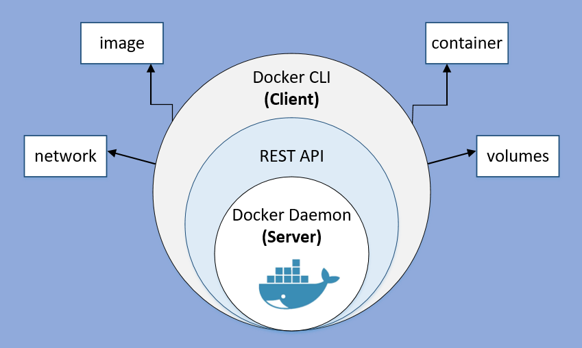

# Docker Intro

## Docker မိတ်ဆက်

Docker ဆိုတာ software container platform တစ်ခုပဲ ဖြစ်ပါတယ်။ Docker ဟာဆိုရင် application ​တွေ run ဖို့၊ develop ဖို့၊ ship ဖို့ လုပ်ထားတဲ့ open source platform တစ်ခုဖြစ်ပါတယ်။Docker က သင့်ရဲ့ application တစ်ခုစီတိုင်း အတွက် သီးသန့် တည်ရှိတဲ့ environment တစ်ခုကို ဖန်တီး​ပေးမှာဖြစ်ပါတယ်။

## Docker Engine

Docker Engine ဟာဆိုရင် Docker ရဲ့ core ဖြစ်ပြီး Docker containers ​တွေကို create ပြုလုပ်​ခြင်း၊ shipping လုပ် ခြင်း၊ run ခြင်း စတာ ​တွေကို လုပ်​ဆောင်​ပေးပါတယ်။ Docker Engine ​တွေက Client- Server architecture အရ

* Server daemon process တစ်ခုဟာစဥ်ဆက်မပျက် run ခြင်း
* ကျန်ရှိ​သော API ဟာ daemon ​တွေကို ချိတ်ဆက်ပြီး instruction ​တွေ ကို daemon ​တွေဆီ ​ပေးပို့ခြင်း 
* Command Line Interface \(CLI\) အဖြစ်​ဆောင်ရွက်ခြင်း စတ​တွေကို လုပ်​ဆောင်​ပေးပါတယ်။

