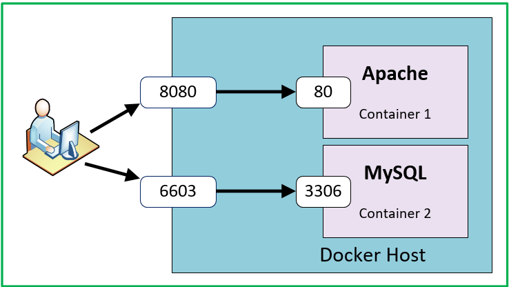
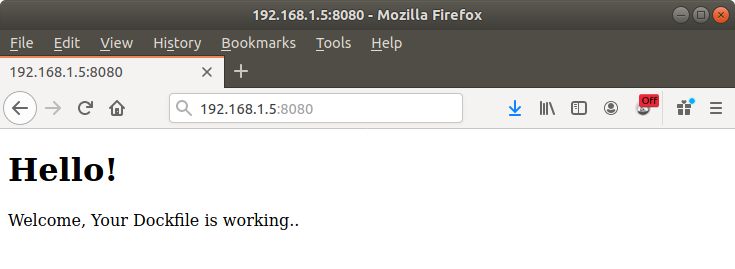

# Docker Port

## Manage Ports in Docker

Docker containers တွေထဲမှာဆိုရင် servicesတွေက သီးခြား port တစ်ခုစီပေါ်မှာ run လေ့ရှိပါတယ်။ port တစ်ခုပေါ်မှာ run နေတယ် containerရဲ့ services ‌တွေကို အသုံးပြုချင်တယ်ဆိုရင် container ရဲ့ port ကို Docker host ရဲ့ port တစ်တစ်ခုခုနဲ့ bindပေးရပါတယ်။

### ဥပမာ ၁

အောက်‌ကပုံကိုကြည့်ပါ။ Docker host ထဲမှာ container နှစ်လုံး run နေတာကို တွေ့ရပါလိမ့်မယ်။ ပထမတစ်ခုကတော့ website တွေ runနေတဲ့ Apache container ဖြစ်ပြီးတော့ ဒုတိယတစ်ခုကတော့ MySQL container ဖြစ်ပါတယ်။  




အခုကျွန်တော်တို့ port 80 Apache container ပေါမှာ run နေတယ် website ကိုဝင်ရောက်ကြည့်ရှုဖို့လိုအပ်နေပါတယ်။ အဲတော့ ကျွန်တောတို့ Apache container port 80 ကို Docker host port 8080 နဲ့ bind လိုက်ကြရအောင်။ Docker host port 80 နဲ့လဲ bind လို့ရပါတယ်။

ဒုတိယ container port 3306 ပေါ်မှာ MySQL run နေပါတယ်။ Host machine ကနဲ့ MySQL ကို အခြားနည်းလမ်းတွေနဲ့ access လုပ်လို့ရပါတယ်။ ဒါပေမယ့်ဒီသင်ခန်းစာအတွက် MySQL container port 3306 ကို docker host port 6603 နဲ့ကျွန်တော် bindလိုက်ပါတယ်။ အခုကျွန်တော်တို့ Host machine ရဲ့ port 6603 ကိုသုံးပြီး MySQL container ကိုတိုက်ရိုက်ဆက်သွယ်နိုင်ပါတယ်။

အောက်က command ကတော့ host system port နဲ့ container port ကို bind ပေးမယ် command ဖြစ်ပါတယ်။

```bash
$ docker run -it -p 8080:80 apache_image
$ docker run -it -p 6603:3066 mysql_image
```

### ဥပမာ ၂

ဒီဥပမာမှာတော့ GitHub ပေါ်မှာရှိတယ် ကျွန်တော်တို့ရဲ နမူနာ project ကိုသုံးရမှာဖြစ်ပါတယ်။ အောက်က command ကိုသုံးပြီးတော့ repository ကို clone လိုက်ပါ။

```bash
$ git clone https://github.com/tecrahul/dockerfile
$ cd dockerfile
```

အခု apacheimage ဆိုတဲ့အမည်နဲ့ docker image ကို build လိုက်ပါ။

```bash
$ docker build -t apacheimage .
```

အခု Docker run command ကိုသုံးပြီး‌တော့ containerကို runလိုက်ပါ။ container port 80 ပေါ်မှာ Apache service run သွားပါလိမ့်မယ်။ host system port 8080 ကို container port 80 နှင့် bind ဖြစ်ဖို့ `-p 8080: 80` ကိုသတ်မှတ်ရပါမယ်။

```bash
$ docker run -it -p 8080:80 apacheimage
```

အခု Web browser ထဲမှာ host machine ip နဲ့ port 8080 သုံးပြီး access လုပ်မယ်ဆိုလိုရှိရင် အောက်မှာပြထားတယ်ပုံအတိုင်း container ရဲ့ Apache service ပေါ်မှာ run နေတယ် web page တစ်မျက်မှာပေါ်လာပါလိမ့်မယ်။ ကျွန်တော့်ရဲ host machine ip ကတော့ 192.168.1.237 ဖြစ်ပါတယ်။



### ဥပမာများ

ကျွန်တော်တို့ container တစ်ခုတည်းနဲ့ port များစွာကို bind နိုင်ပါတယ်။ ဒါပေမဲ့ image build မလုပ်ခင် port အားလုံးကို dockerfile ထဲမှာ `EXPOSE` လုပ်ထားရပါမယ်။

```bash
$ docker run -it -p 8080:80,8081:443 image_name
```

တစ်ကယ်လို့ host machine ရဲ့ interface တစ်ခုခုနဲ့ bind ချင်တယ်ဆိုလို့ရှိရင် အောက်ကအတိုင်း IP သက်မှတ်ပေးလိုက်လို့ရပါတယ်။ အောက်က ဉပမာအရ port 8080 နဲ့ 8081 ကို 127.0.0.1 IP နဲ့သာ access လုပ်လို့ရပါတယ်။

```bash
$ docker run -it -p 127.0.0.1:8080:80,127.0.0.1:8081:443 image_name
$ docker run -it -p 192.168.1.111:8080:80,92.168.1.111:8081:443 image_name
```

