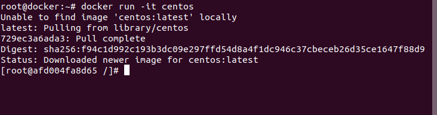
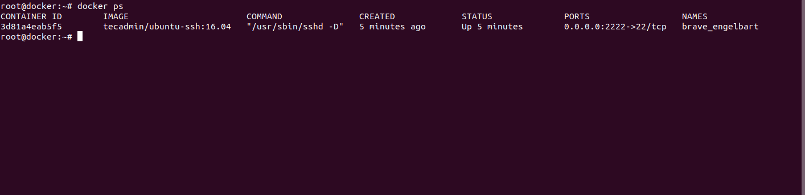
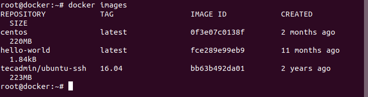
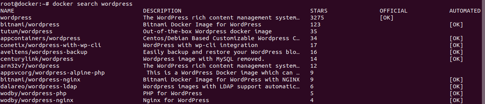
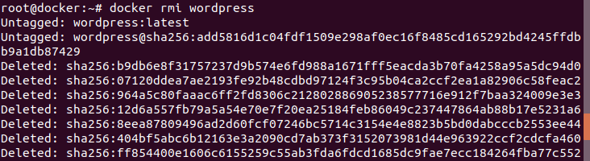
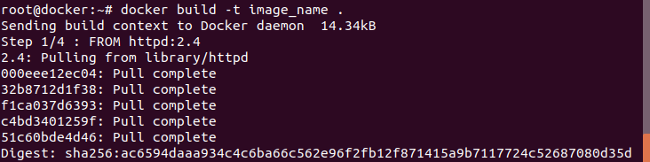
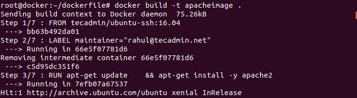

# Docker Intro

## Docker မိတ်ဆက်

Docker ဆိုတာ software container platform တစ်ခုပဲ ဖြစ်ပါတယ်။ Docker ဟာဆိုရင် application ​တွေ run ဖို့၊ develop ဖို့၊ ship ဖို့ လုပ်ထားတဲ့ open source platform တစ်ခုဖြစ်ပါတယ်။Docker က သင့်ရဲ့ application တစ်ခုစီတိုင်း အတွက် သီးသန့် တည်ရှိတဲ့ environment တစ်ခုကို ဖန်တီး​ပေးမှာဖြစ်ပါတယ်။

## Docker Engine

Docker Engine ဟာဆိုရင် Docker ရဲ့ core ဖြစ်ပြီး Docker containers ​တွေကို create ပြုလုပ်​ခြင်း၊ shipping လုပ် ခြင်း၊ run ခြင်း စတာ ​တွေကို လုပ်​ဆောင်​ပေးပါတယ်။ Docker Engine ​တွေက Client- Server architecture အရ

* Server daemon process တစ်ခုဟာစဥ်ဆက်မပျက် run ခြင်း
* ကျန်ရှိ​သော API ဟာ daemon ​တွေကို ချိတ်ဆက်ပြီး instruction ​တွေ ကို daemon ​တွေဆီ ​ပေးပို့ခြင်း 
* Command Line Interface \(CLI\) အဖြစ်​ဆောင်ရွက်ခြင်း စတ​တွေကို လုပ်​ဆောင်​ပေးပါတယ်။


\pagebreak 

# Docker Features

## Features of Docker

### Docker container

Docker container တစ်ခုဟာ application တစ်ခု packaging လုပ်ဖို့၊ running လုပ်ဖို့ သီးသန့် environment တစ်ခု အဖြစ်​ရှိ​တာ ဖြစ်ပါတယ်။ပိုမွန်​မြန်ဆန်​ကောင်းမွန်တဲ့ computing ကိုရနိုင်ဖို့ Docker မှာ application တစ်ခုကို side by side ယှဥ်လျက် run နိုင်မှာ ဖြစ်ပါတယ်။ ပြီး​တော့ Single Host တစ်ခုမှာပဲ တစ်ခုထက်ပိုတဲ့ containers ​တွေကို run နိုင်ပါ​သေးတယ်။ အဲ့ containers ​တွေကိုပဲ run ထားတဲ့ host က္​နေ တစ်ခြား host တစ်ခုဆီကို ​ပြောင်း​​ရွှေ့ နိုင်ဦးမှာဖြစ်ပါတယ်။

\pagebreak 

# Docker Install

## Docker installation on Ubuntu

**Docker ကို ubuntu OS မှာ install ပြုလုပ်ဖို့ အောက်ပါ command တွေကို တခုချင်း terminal တွင်ရိုက်ထည့်ပါ။**

* ပထမဆုံး လက်ရှိ package များကို update ပြုလုပ်ပါမယ်။

```text
$ sudo apt-get update
```

* ထို့နောက် လိုအပ်တဲ့ package များကို သွင်းပါမယ်။

  ```text
  $ sudo apt-get install apt-transport-https ca-certificates curl gnupg-agent software-properties-common
  ```

* ထို့နောက် Docker repository ကို add လုပ်ပါမယ်။

  ```text
  $ curl -fsSL https://download.docker.com/linux/ubuntu/gpg | sudo apt-key add -
  ```

  ```text
  $ sudo add-apt-repository "deb [arch=amd64] https://download.docker.com/linux/ubuntu $(lsb_release -cs) stable"
  ```

* နောက်ဆုံးအဆင့်အနေနဲ့ update ပြုလုပ်ပြီး docker ကို သွင်းနိုင်ပါပြီ။

  ```text
  $ sudo apt-get update
  ```

  ```text
  $ sudo apt-get install docker-ce docker-ce-cli containerd.io
  ```

* Docker service run နေကြောင်းကို သိရှိနိုင်ရန် ယခုကဲ့သို ရိုက်ထည့်ပါ။

  ```text
  $ sudo systemctl status docker
  ```

`Active: active` ဖြစ်နေပါက docker service run နေကြောင်း သိရှိနိုင်ပါတယ်။

Docker daemon service နှင့်အတူ docker cli ကိုပါ တပါးတည်း ထည့်သွင်းထားတဲ့ အတွက် docker cli ကိုလဲ အသုံးပြုနိုင်မှာဖြစ်ပါတယ်။Docker command များ ကို ယခုလို ကြည့်ရှူနိုင်ပါတယ်။

```text
$ docker
```

```text
Output:


Management Commands:
  builder     Manage builds
  config      Manage Docker configs
  container   Manage containers
  context     Manage contexts
  engine      Manage the docker engine
  image       Manage images
  network     Manage networks
  node        Manage Swarm nodes
  plugin      Manage plugins
  secret      Manage Docker secrets
  service     Manage services
  stack       Manage Docker stacks
  swarm       Manage Swarm
  system      Manage Docker
  trust       Manage trust on Docker images
  volume      Manage volumes

Commands:

  attach      Attach local standard input, output, and error streams to a running container
  build       Build an image from a Dockerfile
  commit      Create a new image from a container's changes
  cp          Copy files/folders between a container and the local filesystem
  create      Create a new container
  diff        Inspect changes to files or directories on a container's filesystem
  events      Get real time events from the server
  exec        Run a command in a running container
  export      Export a container's filesystem as a tar archive
  history     Show the history of an image
  images      List images
  import      Import the contents from a tarball to create a filesystem image
  info        Display system-wide information
  inspect     Return low-level information on Docker objects
  kill        Kill one or more running containers
  load        Load an image from a tar archive or STDIN
  login       Log in to a Docker registry
  logout      Log out from a Docker registry
  logs        Fetch the logs of a container
  pause       Pause all processes within one or more containers
  port        List port mappings or a specific mapping for the container
  ps          List containers
  pull        Pull an image or a repository from a registry
  push        Push an image or a repository to a registry
  rename      Rename a container
  restart     Restart one or more containers
  rm          Remove one or more containers
  rmi         Remove one or more images
  run         Run a command in a new container
  save        Save one or more images to a tar archive (streamed to STDOUT by default)
  search      Search the Docker Hub for images
  start       Start one or more stopped containers
  stats       Display a live stream of container(s) resource usage statistics
  stop        Stop one or more running containers
  tag         Create a tag TARGET_IMAGE that refers to SOURCE_IMAGE
  top         Display the running processes of a container
  unpause     Unpause all processes within one or more containers
  update      Update configuration of one or more containers
  version     Show the Docker version information
  wait        Block until one or more containers stop, then print their exit codes
```

ဒါပေမယ့် docker ကို ထည့်သွင်းလိုက်ချိန်မှာ root user အနေနဲ့သာ docker နဲ့ သတ်ဆိုင်တဲ့ command တွေကို ရိုက်သွင်းနိုင်မှာဖြစ်ပါတယ်။ မိမိက docker နဲ့ command တခုခုကို run မယ်ဆိုရင် sudo command နဲ့သာ အသုံးပြုနိုင်မှာ ဖြစ်ပါတယ်။ ဥပမာ..

```text
  $ sudo docker image ls
```

Docker ကို ထည့်သွင်း ချိန် docker ဆိုတဲ့ linux user group တခုကို docker က create လုပ်သွားမှာဖြစ်ပါတယ်။ တကယ်လို့ မိမိက sudo ကို အမြဲ မထည့်ပေးစေချင်ဘူးဆိုရင် docker group ထဲကို လက်ရှိ user ကို add ပေးလိုက်ခြင်းဖြစ် sudo command ကို အမြဲရိုက်ထည့်ပေးစရာမလိုပဲ အသုံးပြုနိုင်ပါတယ်။

```text
$ sudo usermod -aG docker ${USER}
```

ထို့နောက် docker service ကို restart ချပါ။

```text
$ sudo systemctl restart docker
```

Docker service active ဖြစ်လာပါက docker ကို စတင် အသုံးပြုနိုင်မှာဖြစ်ပါတယ်။

\pagebreak 

# Docker Container

## Docker Container

Docker container ဆိုတာ docker image တစ်ခုကို run လိုက်တဲ့အခါမှာ တည်ဆောက်လိုက်တဲ့ instance လေးတစ်ခုပဲ ဖြစ်ပါတယ်။ Container တစ်လုံးဟာ application တွေကို အလုပ်လုပ်စေဖို့အတွက်လိုအပ်တဲ့ libraries တွေနဲ့ setting တွေကိုသာ ပေါင်းစပ်ဖွဲ့စည်းထားတာ ဖြစ်ပါတယ်။ အဲ့ဒါဟာ Application တစ်ခုအတွက် အရမ်းကိုပေ့ါးပါးပြီး အလွယ်တစ်ကူရွှေ့ပြောင်းလို့ရ လောက်အောင် သေးငယ်တဲ့ environment တစ်ခုပဲ ဖြစ်ပါတယ်။

## Run Docker Container

System ပေါ်မှာ Docker Container တစ်လုံးကို စတင်မောင်းနှင်ရန်အတွက် docker run command ကို အသုံးပြုပါတယ်။ ဥပမာအားဖြင့် - အောက်ပါ command ကိုရိုက်လျှင် hello-world image ကိုအသုံးပြု၍ docker container တစ်လုံးကို တည်ဆောက်ပါလိမ့်မယ်။

```text
$ docker run hello-world
```

အခု .. CentOS operating system ကို အသုံးပြုပြီးတေ့ာ အလုပ်လုပ်နေမယ့် docker container တစ်လုံးကို တည်ဆောက်ပါမယ်။ -it ဆိုတဲ့ option က pseudo-TTY အသုံးပြုလို့ရတဲ့ interactive session တစ်ခုကို ပေးပါတယ်။ အဲ့ဒီကနေ container shell ကို ချက်ချင်းသုံးလို့ရပါလိမ့်မယ်။

```text
$ docker run -it centos
```



ကျွန်တော်တို့ customized လုပ်ထားတဲ့ ssh access enabled လုပ်ထားတဲ့ Ubuntu docker image ကိုလည်း [docker hub repository](https://hub.docker.com/r/tecadmin/ubuntu-ssh/) မှာ စမ်းကြည့်လို့ရပါတယ်။

```text
$ sudo docker run -d -p 2222:22 tecadmin/ubuntu-ssh:16.04
```

## List Docker Containers

လက်ရှိ System ပေါ်မှာ အလုပ်လုပ်နေတဲ့ containers တွေအားလုံးကို list ထုတ်ကြည့်ချင်ရင် docker ps command ကိုသုံးပါတယ်။ အဲဒီ command က ရပ်ထားတဲ့ container တွေကိုတော့ list ထုတ်ပြမှာ မဟုတ်ပါဘူး။ အဲ့ဒါက Container ID, Container နာမည် နဲ့ container နဲ့ပတ်သက်တဲ့ အခြားအသုံးဝင်တဲ့ information တွေကိုပါ ပြပေးမှာဖြစ်ပါတယ်။

```text
$ docker ps
```

အပေါ်က command မှာ -a ဆိုတဲ့ option ကိုပါ ထည့်သုံးမယ်ဆိုရင်တော့ ရပ်ထားတဲ့ container တွေကိုပါ list ထုတ်ပြပေးမှာဖြစ်ပါတယ်။

```text
$ docker ps -a
```



## Find all Details of Container

Docker container တစ်လုံးနဲ့ပတ်သက်တဲ့ အသေးစိတ်အချက်အလက်အားလုံးကို ရှာချင်တဲ့အခါမှာတော့ docker inspect command ကို အသုံးပြုပါတယ်။ Container ရဲ့ အသေးစိတ်အချက်အလက်တွေကို သိချင်တယ်ဆိုရင်တော့ ကိုယ်သိချင်တဲ့ container ရဲ့ container ID သို့မဟုတ် container နာမည်ကို တိတိကျကျထည့်ပေးရမှာဖြစ်ပါတယ်။

```text
$ docker inspect cc5d74cf8250
```

## Delete Docker Container

System ထဲမှာရှိနေတဲ့ docker container ကို ဖျက်ချင်တယ်ဆိုရင်တော့ docker rm command ကို အသုံးပြုပါတယ်။ Container ကိုဖျက်ချင်တယ်ဆိုရင်တော့ ကိုယ်ဖျက်ချင်တဲ့ container ရဲ့ container ID သို့မဟုတ် container နာမည်ကို တိတိကျကျထည့်ပေးရမှာဖြစ်ပါတယ်။

```text
$ docker stop cc5d74cf8250
$ docker rm cc5d74cf8250
```

\pagebreak 

# Docker Images

## Docker Images

Docker image ဆိုတာကတော့ container တစ်ခုမှာ လိုချင်တဲ့ application တွေ ကိုအသုံးပြုလို့ရအောင်ပြုလုပ်ထားတဲ့ file တစ်ခုပါပဲ။ Docker image တွေဟာ ပြုလုပ်ပြီးတဲ့အချိန်ကစပြီး ဖျက်လိုက်တဲ့အချိန်အထိ အပြောင်းအလဲမရှိနိုင်ပါဘူး။ ထပ်ပြီးပြင်ဆင်လို့လည်းမရနိုင်ပါဘူး။ ပြီးတော့ image တွေဟာ တစ်ခြားသူတွေနဲ့လည်း မျှဝေအသုံးပြုနိုင်ပါသေးတယ်။ ဆိုလိုတာကတော့ တစ်ယောက်ပြုလုပ်ထားတဲ့ image ကိုသုံးပြီး နောက်တစ်ယောက်က ထပ်တူကျတဲ့ container တစ်ခုကို အသုံးပြုနိုင်တာမျိုးပါ။

အောက်မှာတော့ docker images တွေကိုအသုံးပြုဖို့အတွက် အခြေခံကျတဲ့ command တွေကို အကျဥ်းဖော်ပြပေးထားပါတယ်။

## List Docker Images

docker images ဆိုတဲ့ command နဲ့ ကိုယ့်စနစ်ထဲက အသုံးပြုလို့ရတဲ့ image တွေကိုစစ်ကြည့်လို့ရနိုင်ပါတယ်။

```text
$ docker images
```



## Search Docker Images

docker search ဆိုတဲ့ command ကတော့ [docker hub](https://hub.docker.com/) ကနေ လိုချင်တဲ့ image ကိုရှာတဲ့အခါသုံးပါတယ်။ ဥပမာ WordPress အတွက် images တွေကိုရှာမယ်ဆိုရင် -

```text
$ docker search wordpress
```



## Download Docker Images

လိုချင်တဲ့ image ကိုရှာတွေ့ပြီဆိုရင်တော့ docker pull ဆိုတဲ့ command နဲ့ ကိုယ့်စက်ထဲကို download ဆွဲနိုင်ပါတယ်။ ဥပမာ Docker hub ကနေ WordPress အတွက်နောက်ဆုံးversion ဖြစ်တဲ့image ကို download ချမယ်ဆိုရင်

```text
$ docker pull wordpress
```


## Delete Docker Images

မလိုအပ်တော့တဲ့ image တွေကို ဖျက်ပစ်ဖို့အတွက်ကတော့ docker rmi ဆိုတဲ့ command ကိုသုံးပါတယ်။ ဥပမာ -

```text
 $ docker rmi wordpress
```



\pagebreak 

# Dockerfile

## Working with Dockerfile

Dockerfile ဆိုတာ နာမည်​အတိုင်းပဲ file တစ်​ခုပါပဲ။ သူ့ဆီမှာ တိကျတဲ့ instructions ​တွေပါမယ်​ အဲ့ instructions ​တွေနဲ့ ကိုယ်​လိုချင်​တဲ့ customized images ​တွေကို​ build လုပ်​ပါတယ်​ Default အ​နေနဲ့​တော့ နာမည်​ကို Dockerfile လို့ တ​ဝေမသိမ်း​ပေးရပါမယ်​။

## Build Image with Dockerfile

```text
$ docker build -t image_name .
```



ဒါက​တော့ ​ရေးပြီးသား dockerfile နဲ့ image build လုပ်​တဲ့ command ပါ။ `-t`ဆိုတာ tag name ကိုကိုယ်​စားပြုပါတယ်​ သူ့အ​နောက်​မှာ image name လိုက်​ပါတယ်​ ​သေချာကြည်​့ပါ command အဆုံးမှာ `( . )` ပါပါတယ်​ သူက current working directory မှာ ရှိတဲ့ Dockerfile ကိုယူပြီးသုံးမယ်​လို့ ဆိုလိုတာပါ အကယ်​၍ ခင်​​ဗျားမှာသာ Dockerfile တစ်​ခုမက ရှိ​နေရင်​ သို့မဟုတ်​ Dockerfile မှာ နာမည်​အစ D ကသာ small letter \(d\) ဖြစ်​​နေခဲ့မယ်​ဆိုရင်​ error တက်​နိုင်​ပါတယ်​

```text
$ docker build -t image_name -f /path/to/Dockerfile
```


ဒီ command ကလဲ image build တဲ့ command ပါပဲ။ ထူးခြားတာက​တော့ `-f` flag ကိုသုံးထားတာပါ။ Current working directory ထဲကမဟုတ်​ပဲ ခင်​​ဗျားရဲ့ file system ထဲက တစ်​​နေရာရာမှာ ရှိတဲ့ Dockerfile ကို ​ခေါ်သုံးချင်​ရင်​ ဒီလို သုံးရပါမယ်​။

## Create a Dockerfile

ဒီ​နေရာမှာ အစမ်​း​အ​နေနဲ့ Github ​ပေါ်က sample project ကိုယူသုံးပါ့မယ်​

```text
$ git clone https://github.com/tecrahul/dockerfile 
$ cd dockerfile
$ docker build -t apacheimage .
```



အ​ပေါ်က command သုံး​ကြောင်းပြီးရင်​ image တစ်​ခု​ဆောက်​ပြီးပါပြီ ​ဆောက်​ပြီးသား images ​တွေကို docker images ဆိုတဲ့ command နဲ့​ခေါ်ကြည့်နိုင်​ပါတယ်​။

## Launch Container with Image

```text
$ docker run -it -p 8080:80 apacheimage
```

ဒီcommand နဲ့ ​ဆောက်​ပြီးသား image ကိုသုံးပြီး container တစ်​ခုတည်​​ဆောက်​ပါတယ်​။ `i`က interactive နဲ့ `t`က tty ကို ကိုယ်​စားပြုပါတယ်​။ `-p`ဆိုတာက​တော့ port သတ်​မှတ်​​ပေးတာပါ၊ ဒီ ဥပမာမှာဆို ကိုယ့် host system ရဲ့ port 8080 နဲ့ container ရဲ့ port 80ကို ချိတ်​​ပေးဖို့ သုံးထားတာကို ​တွေ့ရမှာပါ။ အ​ရှေ့က ကိုယ်​့ host systemရဲ့ port ကြားမှာ full column `( : )` နဲ့ အ​နောက်​က container ရဲ့ port ကို​ရေးရမှာပါ။

\pagebreak 

# Dockerfile Directives

## What are Dockerfile Directives

အ​ရှေ့မှာ Dockerfile ကိုသုံးပြီး image ​ဆောက်​ အဲ့ image ကိုသုံးပြီး​တော့ container ​တွေ ​ဆောက်​တာကို မြင်​ခဲ့ရပြီးပါပြီ။

အခု​ပြောမှာက​တော့ အဲ့ Dockerfile ကို ဘယ်​လို​ရေးမလဲဆိုတာပါ။

Dockerfile ကို Docker directive ​တွေနဲ့​ရေးရတာပါ။

### FROM

ဒီ FROM ဆိုတဲ့ directive ကို base image ယူသုံးဖို့အတွက်​ သုံးတာပါ။ ဥပမာ ခင်​​ဗျားက ubuntu command ​တွေ သုံးလို့ရမဲ့ container တစ်​လုံးလိုချင်​တာဆိုရင်​ `FROM ubuntu` ဆိုပြီးသုံးရမှာပါ။

Default အ​နေနဲ့ဆို docker store မှာရှိတဲ့ ubuntu version ​တွေထဲကမှ latest version ကို ယူသုံးသွားမှာပါ အဲ့လိုမှမဟုတ်​ဘူး latest လိုချင်​တာမဟုတ်​ဘူး ကိုယ်​လိုချင်​တာ သက်​သက်​ဆို အခုလို​ရေးလို့ရပါတယ်​ `FROM tecadmin/ubuntu-ssh:16.04`

### LABEL

ဒါက​တော့ နာမည်​အတိုင်​းပဲ label တပ်​တာပါ။ `Maintainer addres​s,vendor name,image version,release date` အစရှိသဖြင့်​ပေါ့။ ဥပမာ

```text
LABEL maintainer="rahul@tecadmin.net"
LABEL vendor="TecAdmin"
LABEL com.example.version="0.01"
```

လို့ ရိုက်​လိုက်​ရုံပါပဲ။ အကြံပြု လိုတာက​တော့ တစ်​ line ထဲကို space ခံ single line ခံပြီး ​ရေးတာကိုပါ။ Image build တဲ့အချိန်​မှာ စာ​ကြောင်းတစ်​​ကြောင်းကို layer တစ်​ခု ​ဆောက်​တာပါ Layer နည်း​လေ မြန်​​လေပါပဲ။

```text
LABEL maintainer="rahul@tecadmin.net" vendor="TecAdmin" \
com.example.version="0.01"
```

### RUN

RUN ကို​တော့ လိုအပ်​တဲ့ command​တွေ run ဖို့သုံးပါတယ်။ ဥပမာ လိုအပ်တဲ့​package​တွေ သွင်းဖို့လိုတဲ့အခါမျိုး​ပေါ့။

```text
RUN apt-get update 
RUN apt-get install -y apache2 automake build-essential curl ​​
```

ဒီ​နေရာမှာလဲ အ​ပေါ်ကလို တစ်​​ကြောင်းထဲဖြစ်​​အောင်​ ​ရေးသင့်ပါတယ်​။ Layer နည်း​လေ​ကောင်း​လေပါ။

```text
RUN apt-get update && apt-get install -y \
automake \
build-essential \
curl
```

### COPY

ဒါကို​တော့ ကိုယ့်စက်​ထဲမှာရှိတဲ့ files ​တွေ directories ​တွေကို ​ဆောက်​မယ့် image ​ပေါ်copy ကူးချင်​ရင်​ သုံးပါတယ်။​

```text
COPY html/* /var/www/html/
COPY *.conf /etc/apache2/sites-available/
```

ပထမ command ရိုက်​လိုက်​ရင်​ host ရဲ့ html directory ​အောက်​က file အကုန်​ကို image ရဲ့ /var/www/html/ ​အောက်​ကို copy ကူသွားမှာပါ။

ဒုတိယ command က​တော့ host ရဲ့ .conf extension file အားလုံးကို image ရဲ့ /etc/apache2/sites-available/ ​အောက်​ကို​ပေါ့။

### WORKDIR

ဒိ directive ကို​တော့ dockerfile ရဲ့အခြား​သော directives ​တွေဖြစ်​တဲ့ `RUN,CMD,ENTRYPOINT,COPY,ADD` ​တွေရဲ့ working directory သတ်​မှတ်​​ပေးဖို့သုံးပါတယ်​

```text
WORKDIR /opt
```

### CMD

CMD directive ကို​တော့ image မှာပါတဲ့ service,software ​တွေကို container launch လုပ်​​တာနဲ့ run ဖို့သုံးပါတယ်။​ သူ့ရဲ့ syntax က​တော့

```text
CMD ["executable","param1","param2"]
CMD ["executable","param1","param2"]
```

အကယ်​၍ခင်​​ဗျားက apache service ကို runချင်​တယ်​ဆိုပါ​တော့

```text
CMD ["apachectl", "-D", "FOREGROUND" ]
```

### EXPOSE

ဒါက container ရဲ့ port ကိုညွှန်းဆိုမဲ့ directive ပါ။ အ​ပေါ်မှာ​တွေခဲ့တဲ့ docker run -it -p နဲ့ port ချိတ်​တာမှာ ဒီက ညွှန်းဆိုထားတဲ့ port ​တွေနဲ့ ချိတ်​​ပေးရပါမယ်​။

```text
EXPOSE 80
EXPOSE 443
```

### ENV

ENV directive ကို​တော့ environment variable သတ်​မှတ်​​ပေးချင်​ရင်​ သုံးတာပါ

```text
ENV PATH=$PATH:/usr/local/psgql/bin/ \
    PG_MAJOR=9.6.0
```

### VOLUME

​နောက်​ဆုံး အ​နေနဲ့​တော့ VOLUME directive ပါ။ သူ့ကို​တော့ mount point create ဖို့ သုံးပါတယ်​။ သိထားဖို့က သူဟာ externally mounted volumes ပဲဖြစ်​ပါတယ်​။

```text
VOLUME ["/data"]
```

\pagebreak 

# Docker Port

## Manage Ports in Docker

Docker containers တွေထဲမှာဆိုရင် servicesတွေက သီးခြား port တစ်ခုစီပေါ်မှာ run လေ့ရှိပါတယ်။ port တစ်ခုပေါ်မှာ run နေတယ် containerရဲ့ services ‌တွေကို အသုံးပြုချင်တယ်ဆိုရင် container ရဲ့ port ကို Docker host ရဲ့ port တစ်တစ်ခုခုနဲ့ bindပေးရပါတယ်။

### ဥပမာ ၁

အောက်‌ကပုံကိုကြည့်ပါ။ Docker host ထဲမှာ container နှစ်လုံး run နေတာကို တွေ့ရပါလိမ့်မယ်။ ပထမတစ်ခုကတော့ website တွေ runနေတဲ့ Apache container ဖြစ်ပြီးတော့ ဒုတိယတစ်ခုကတော့ MySQL container ဖြစ်ပါတယ်။  


အခုကျွန်တော်တို့ port 80 Apache container ပေါမှာ run နေတယ် website ကိုဝင်ရောက်ကြည့်ရှုဖို့လိုအပ်နေပါတယ်။ အဲတော့ ကျွန်တောတို့ Apache container port 80 ကို Docker host port 8080 နဲ့ bind လိုက်ကြရအောင်။ Docker host port 80 နဲ့လဲ bind လို့ရပါတယ်။

ဒုတိယ container port 3306 ပေါ်မှာ MySQL run နေပါတယ်။ Host machine ကနဲ့ MySQL ကို အခြားနည်းလမ်းတွေနဲ့ access လုပ်လို့ရပါတယ်။ ဒါပေမယ့်ဒီသင်ခန်းစာအတွက် MySQL container port 3306 ကို docker host port 6603 နဲ့ကျွန်တော် bindလိုက်ပါတယ်။ အခုကျွန်တော်တို့ Host machine ရဲ့ port 6603 ကိုသုံးပြီး MySQL container ကိုတိုက်ရိုက်ဆက်သွယ်နိုင်ပါတယ်။

အောက်က command ကတော့ host system port နဲ့ container port ကို bind ပေးမယ် command ဖြစ်ပါတယ်။

```bash
$ docker run -it -p 8080:80 apache_image
$ docker run -it -p 6603:3066 mysql_image
```

### ဥပမာ ၂

ဒီဥပမာမှာတော့ GitHub ပေါ်မှာရှိတယ် ကျွန်တော်တို့ရဲ နမူနာ project ကိုသုံးရမှာဖြစ်ပါတယ်။ အောက်က command ကိုသုံးပြီးတော့ repository ကို clone လိုက်ပါ။

```bash
$ git clone https://github.com/tecrahul/dockerfile
$ cd dockerfile
```

အခု apacheimage ဆိုတဲ့အမည်နဲ့ docker image ကို build လိုက်ပါ။

```bash
$ docker build -t apacheimage .
```

အခု Docker run command ကိုသုံးပြီး‌တော့ containerကို runလိုက်ပါ။ container port 80 ပေါ်မှာ Apache service run သွားပါလိမ့်မယ်။ host system port 8080 ကို container port 80 နှင့် bind ဖြစ်ဖို့ `-p 8080: 80` ကိုသတ်မှတ်ရပါမယ်။

```bash
$ docker run -it -p 8080:80 apacheimage
```

အခု Web browser ထဲမှာ host machine ip နဲ့ port 8080 သုံးပြီး access လုပ်မယ်ဆိုလိုရှိရင် အောက်မှာပြထားတယ်ပုံအတိုင်း container ရဲ့ Apache service ပေါ်မှာ run နေတယ် web page တစ်မျက်မှာပေါ်လာပါလိမ့်မယ်။ ကျွန်တော့်ရဲ host machine ip ကတော့ 192.168.1.237 ဖြစ်ပါတယ်။


### ဥပမာများ

ကျွန်တော်တို့ container တစ်ခုတည်းနဲ့ port များစွာကို bind နိုင်ပါတယ်။ ဒါပေမဲ့ image build မလုပ်ခင် port အားလုံးကို dockerfile ထဲမှာ `EXPOSE` လုပ်ထားရပါမယ်။

```bash
$ docker run -it -p 8080:80,8081:443 image_name
```

တစ်ကယ်လို့ host machine ရဲ့ interface တစ်ခုခုနဲ့ bind ချင်တယ်ဆိုလို့ရှိရင် အောက်ကအတိုင်း IP သက်မှတ်ပေးလိုက်လို့ရပါတယ်။ အောက်က ဉပမာအရ port 8080 နဲ့ 8081 ကို 127.0.0.1 IP နဲ့သာ access လုပ်လို့ရပါတယ်။

```bash
$ docker run -it -p 127.0.0.1:8080:80,127.0.0.1:8081:443 image_name
$ docker run -it -p 192.168.1.111:8080:80,92.168.1.111:8081:443 image_name
```

\pagebreak 

# Docker Networking

## Docker Networking

Docker မှာ Network တွေကို docker containers နှင့် ဆက်သွယ်ဖို့အတွက် create နဲ့ manage လုပ်ဆောင်ချက်တွေ ကို ထောက်ပံ့ပေးထားပါတယ်။ **docker network command** ကို အသုံးပြုပြီးတော့ Docker network ကို manage လုပ်လို့ရပါတယ်။

**Syntax:**

```text
$ docker network [options]
```

အောက်ပါ Tutorial ကို လေ့လာပြီး Docker network ကို create , list နဲ့ manage စတဲ့ features တွေကို လုပ်ဆောင်လို့ရပါတယ်။

## Docker Networks များ ကို List လုပ်ခြင်း။

`ls` option ကို အသုံးပြုပြီး docker host ပေါ်မှာ ရှိတဲ့ docker network တွေ ကို List လုပ်လို့ရပါတယ်။

```text
$ docker network ls
```

## Docker Network တခု Create လုပ်ခြင်း။

Network အမျိုးအစား အမျိုးမျိုးကို Docker မှ ထောက်ပံ့ပေးထားပါတယ်။ သင့်ရဲ့ system ပေါ်မှာ a bridge Network တခုကို အောက်ပါ command အသုံးပြုပြီး create လို့ရပါတယ်။

**Syntax:**

```text
$ docker network create -d [network_type] [network_name]
```

**Example:**

```text
$ docker network create -d bridge my-bridge-network
```

## Container ကို Network ချိတ်ခြင်း။

Container နာမည် \(သို့မဟုတ်\) Container ID ကို အသုံးပြုပြီး မည်သည့် container ကိုမဆို ရှိပြီးသား docker network နဲ့ ချိတ်ဆက်နိုင်ပါတယ်။ Container တစ်ခုကို Network နဲ့ တစ်ချိန် ချိတ်ဆက်ထားရုံနဲ့ အခြား container များကိုလဲ တူညီတဲ့ Network တခုတည်းပေါ်မှာ ဆက်သွယ်လုပ်ဆောင်လို့ရပါတယ်။

**Syntax:**

```text
  $  docker network connect [network_name] [container_name]
```

**Example:**

```text
  $ docker network connect my-bridge-network centos
```

## Docker Network နှင့် Container ကို disconnect လုပ်ခြင်း။

သင့်အနေနဲ့ Network တခုပေါ်ကနေ container ကို disconnect လုပ်ချင်ရင် အောက်ပါ command ကို အသုံးပြုနိုင်ပါတယ်။

**Syntax:**

```text
$ docker network disconnect [network_name] [container_name]
```

**Example:**

```text
  $ docker network disconnect my-bridge-network centos
```

## Docker Network တခုရဲ့ အချက်အလက် ကိုကြည့်ခြင်း။

Docker Network တခုရဲ့ အသေးစိတ်အချက် ကို ကြည့်ချင်ရင် inspect option ကို အသုံးပြုပြီး ကြည့်လို့ရပါတယ်။

```text
$ docker network inspect my-bridge-network
```

inspect option ကို အသုံးပြုပြီး Docker Network တခုရဲ့ အသေးစိတ် အချက်အလက်ကိုကြည့်မယ် ဆိုရင် အခုလိုမြင်ရမှာ ဖြစ်ပါတယ်။

## Docker Network ကို Remove ခြင်း။

Docker network တွေကို remove လုပ်မယ်ဆိုရင် rm option ကို အသုံးပြုလို့ပါတယ်။

တခုထက်ပိုတဲ့ docker network တွေကို remove လုပ်ချင်ရင် network ID \(သို့မဟုတ်\) network name တွေကို space ခံပြီး အသုံးပြုပြီး remove လုပ်လို့ရပါတယ်။

**Example:**

```text
  $ docker network rm my-bridge-network network2 network3
```

သင့်အနေနဲ့ docker ပေါ်က အသုံးမပြုတော့တဲ့ network အားလုံးကို remove လုပ်ချင်ရင် prune option ကို အသုံးပြုပြီး remove လုပ်လို့ရပါတယ်။

```text
$ docker network prune
```

\pagebreak 

# Docker Networking Example

## Docker Networking Example

Docker Network tutorial ဖက်ပြီးပြီးဆိုရင် Example လေး စမ်းလုပ်ကြည့်လို့ရပါတယ်။

ကျွန်တော် တို့ ဒီ Tutorial မှာတော့ docker containers နှစ်ခုနဲ့ docker network အသေးစားလေး တခု လုပ်ပြသွားမှာ ဖြစ်ပါတယ်။

> MySQL – A relational database server.
>
> PHPMyAdmin – A web based interface to manage MySQL server.

အခု tutorial မှာတော့ အခြား MySQL server ကို access လုပ်ဖို့အတွက် အခြား container တခုမှာ run ထားတဲ့ PHPMyAdmin ကို အသုံးပြ ပြသသွားမှာ ဖြစ်ပါတယ်။

## Network တခု Create လုပ်ခြင်း။

ပထမဦးစွာ အနေဖြင့် docker network အသစ် တခု ကို Create လုပ်ဖြစ်ပါတယ်။ my-bridge-network အမည်ရှိသော network အသစ်ကို အောက်ပါ comment အသုံးပြု ပြီး create လုပ်ပါ။

```text
  $ docker network create -d bridge my-bridge-network
```

## MySQL Container ကို Run ခြင်း။

အခု ကျွန်တော် တို့ MySQL docker container အသစ် ကို Run မှာ ဖြစ်ပါတယ်။

Default root user password အသစ်ကို သတ်မှတ်ဖို့အတွက် MYSQL\_ROOT\_PASSWORD variable ကို အောက်မှာပြထားတဲ့အတိုင်း ရိုက်ပါ။

```text
$ docker run --name mysql -e MYSQL_ROOT_PASSWORD=secret -d mysql/mysql-server
```

Container တခု create ပြီးနောက် စောစော က ကျွန်တော်တို့ create ထားတဲ့ my-bridge-network network နဲ့ ချိတ်ဆက်မှာ ဖြစ်ပါတယ်။

```text
$ docker network connect my-bridge-network mysql
```

နောက် တဆင့် အနေနဲ့ MySQL container ရဲ့ IP address အသစ် ကိုကြည့်မှာဖြစ်ပါတယ်။

```text
$ docker inspect mysql | grep "IPAddress"
```

## PHPMyAdmin Container ကို Run ခြင်း။

အခု ကျွန်တော်တို့ Docker container အသစ်ဖြစ်တဲ့ phpmyadmin ကို run မှာ ဖြစ်ပါတယ်။

MySQL ကို Run ခြင်း နောက်ဆုံးအဆင့်မှာ ရခဲ့တဲ့ MySQL container IP address ကို PMA\_HOST value အနေနဲ့ထည့်ပါမယ်။

```text
$ docker run --name phpmyadmin -d -e PMA_HOST=172.21.0.2 -p 8080:80 phpmyadmin/phpmyadmin
```

ပြီးနောက် phpmyadmin container ကို my-bridge-network ထဲ add လိုက်ပါ။

```text
$ docker network inspect my-bridge-network
```

## My-bridge-network Network ရဲ့ အချက်အလက် ကိုကြည့်ခြင်း ။

အပေါ်မှာ ပြခဲ့တဲ့ containers နှစ်ခု ကို ကျွန်တော် တို့ my-bridge-network ထဲ ထည့်ပြီးသွား တဲ့ အတွက် လက်ရှိ my-bridge-network ရဲ့ setting ကို ကြည့်လိုက်ရအောင် ။

```text
$ docker network inspect my-bridge-network
```

My-bridge-network ရဲ့ setting ကို ကြည့်ရင်တော့ အခုလိုတွေ့ရမှာဖြစ်ပါတယ်။

## Allow MySQL to PHPMyAdmin Host

MySQL default အနေနဲ့ကတော့ remote hosts connect လုပ်တာကို ခွင့်မပြုထားပါဘူး။

ဆိုတော့ ကျွန်တော် တို့ က MySQL connection အတွက် phpmyadmin ကို allow

လုပ်ပေးရမှာ ဖြစ်ပါတယ်။ MySQL container shell access ရဖို့အတွက် အောက်မှာ ပြထားတဲ့ လုပ်ရမှာဖြစ်ပါတယ်။

```text
$ docker exec -it mysql bash
```

MySQL server ထဲကို MySQL container create လုပ်တုန်းက ပေးထဲ့ခဲ့တဲ့ Password ကို အသုံးပြုပြီး Login ဝင်လိုက်ပါ။

```text
  bash-4.2# mysql -u root -p
```

phpmyadmin host ip address နဲ့ user အသစ် create လုပ်လိုက်ပါ။ ဒီ tutorial ထဲမှာတော့ phpmyadmin host ip address ကတော့ ‘**172.21.0.3**‘ ဖြစ်ပါတယ်။

```text
mysql> GRANT ALL on *.* to 'dbuser'****@****'172.21.0.3' identified by 'secret';
Query OK, 0 rows affected, 1 warning (0.00 sec)

mysql> flush privileges;
Query OK, 0 rows affected (0.00 sec)

mysql> exit
Bye
```

## Access MySQL with PHPMyAdmin

နောက်ဆုံးအနေဖြင့် ကျွန်တော် တို့ ရဲ့ docker host system က port 8080 မှ တဆင့် phpmyadmin web user interface ကို ချိတ်ဆက်လို့ ရသွားပါတယ်။

phpMyAdmin ကို MySQL ရဲ့ အချက်အလက်တွေ သုံးပြီး အပေါ်မှာ ပြထားတဲ့ အတိုင်း Login ဝင်ရန် အသုံးပြုလို့ရပါတယ်။

\pagebreak 

# Docker Compose

## Docker Compose

Docker Compose သည် Containers များကို Setup ပြုလုပ်ရာတွင် အသုံးပြုသည့် Tool တခုဖြစ်သည်။ Docker Compose ကိုသုံးခြင်းဖြင့် docker containers များကို Compose File တစ်ခုအနေဖြင့် ဖန်တီးနိုင်သည်။ Images and Containers များကို လည်း Signal Command ဖြင့် လွယ်ကူစွာ build လုပ်နိုင်ပါတယ်။

Docker Compose ပြုလုပ်ရန် အဆင့် \(3\) ဆင့် ရှိသည်။

* Dockerfile တွင် သုံးမည့် Services များကို သတ်မှတ်ပေးရန်
* မိမိ Enviroment အတွက် သုံးမည့် Service and Application များကို docker-file အဖြစ်ပြုလုပ်ပြီး sample.yml format ဖြင့် သိမ်းဆည်းရမည်။
* Run docker-compose up  Command ဖြင့် Docker Containers Services များကို Run နိုင်သည်။

**စက်တွင် Docker Enginer ရှိဖို့လိုပါသည်။ မရှိလျှင် Docker Engine Installation Section တွင်လေ့လာနိုင်ပါသည်။**

## Install Docker Compose

Docker Compose ကို Install ပြုလုပ်ရန် [https://github.com/docker/compose/releases](https://github.com/docker/compose/releases) \(Github Page\) တွင် ဝင်ရောက်လေ့လာ၍ ရယူနိုင်ပါသည်။

အောက်ပါ Command ဖြင့်လည်း Docker compose 1.16.1 ကို Install ပြုလုပ်နိုင်သည်။ Install မပြုလုပ်ခင် Docker versition နှင့် Specific ဖြစ်မဖြစ် စစ်ဆေးရန်လိုအပ်ပါသည်။

```text
$ curl -L https://github.com/docker/compose/releases/download/1.16.1/docker-compose-`uname -s`-`uname -m` > /usr/local/bin/docker-compose

$ chmod +x /usr/local/bin/docker-compose
```

\pagebreak 

# Docker Compose Example

## Docker Compose Example File

Docker Composer file သည် docker-compose.yml \(format\) ဖြစ်ပြီး အောက်တွင် Version 3 docker composer file ကို Sample ပြထားသည်။ ဤ File သည် Sample ဖြစ်၍ Service တခုဖြစ်သည့် WEB Name တစ်ခုကိုသာ ပြထားသည်။

```text
version: '3'
services:
    db:
        image: mysql
         container_name: mysql_db
          restart: always
        environment:
            - MYSQL_ROOT_PASSWORD="secret"
    web:
        image: apache
        build: .
        container_name: apache_web
        restart: always
        ports:
            - "8080:80"
```

## Docker Compose CLI Reference

Docker Compose နှင့် Docker Container များကို manage ပြုလုပ်ရန်အတွက် docker-compose command ကိုလည်း subcommand အဖြင့် provides လုပ်ပေးသည်။

အောက်တွင့် Subcommand အချို့ကို လေ့လာနိုင်သည်။ သတိပြုရန်မှာ Container Name နှင့် Services name ကို မမှားဖို့ သတိပြုရမည်။

`build -` build option ဖြင့် images များကို build လုပ်ပြီး Services များကို အသုံးပြုနိုင်သည်။

```text
$ docker-compose build             ## Build all services
$ docker-compose build web         ## Build single service
```

`up –` Current Directory အောက်ရှိ docker-composer.yml မှ docker container နှင့် Services များကို Create ပြုလုပ်ရန်ဖြစ်သည်။ \( -d \) Switch သည် Container ကို daemon mode ဖြင့် run စေရန်ဖြစ်သည်။

```text
$ docker-compose up -d            ## Create all containers
$ docker-compose up -d web        ## Create single container
```

`down –` ဤ Option သည် containers များ၏ Neteork, Container Service and Associate Images များကို ရပ်ရန်, ဖျက်ရန် အသုံးပြုနိုင်သည်။

```text
$ docker-compose down           ## Restart all containers
$ docker-compose down web       ## Restart single container
```

`ps –` Container များ၏ Services,Status and Port များ၏ process detail ကို သိနိုင်ရန် သုံးသည်။

```text
$ docker-compose ps
```

`exec –` Running Containers များကို exec ပြုလုပ်ရန်သုံးသည်။ For example, Web Service Run နေသည့် Container ကို list-file အနေဖြင့် ကြည့်ရန်..

```text
$ docker-compose exec web ls -l
```

`start -` Containers များကို Start လုပ်ရန်သုံးသည်။

```text
$ docker-compose start            ## Start all containers
$ docker-compose start web        ## Start single container
```

`stop -` Running Containers များကို ရပ်လိုက်ရန် အသုံးပြုသည်။

```text
$ docker-compose stop             ## Stop all containers
$ docker-compose stop web         ## Stop single container
```

`restart –`

```text
    Containers များကို restart ပြုလုပ်ရန် သုံးသည်။
```

```text
$ docker-compose restart           ## Restart all containers
$ docker-compose restart web       ## Restart single container
```

`pause –` Containers များကို pause လုပ်ရန်သုံးသည်။

```text
$ docker-compose pause            ## Start all paused containers
$ docker-compose pause web        ## Start single paused container
```

`rm –` Containers များကို ဖျက်ရန်, ဖယ်ရှားရန်သုံးသည်။

```text
$ docker-compose rm               ## Start all paused containers
$ docker-compose pause web        ## Start single paused container
```

\pagebreak 

# Docker Compose Example \(latest\)

### Step 1 – Create Directory Structure <a id="step-1-&#x2013;-create-directory-structure"></a>

ပထမဆံုး အနေနဲ႔ docker compose အမည္နဲ႔ directory တစ္ခု တည္ေဆာက္ပါမယ္။ ျပီးေတာ့ web application သိမ္းဖို႔ webapp အမည္ျဖင့္ directory ေဆာက္ပါမည္။ webapp directory ထဲမွာ web application ကိုစမ္းဖို႔ အတကြ္ index.html ကို တည္ေဆာက္ပါမည္။

### Step 2 – Create Dockerfile for Webapp <a id="step-2-&#x2013;-create-dockerfile-for-webapp"></a>

ျပီးေတာ့ web application အတကြ္ လုိအပ္ေသာ dockerfile ကို webapp directory ထဲမွာ ေဆာက္ပါမယ္။ အဲ  directory ထဲမွာ

\pagebreak 

# Docker Machine

## Working With Docker Machine

Docker Machine သည် Command Line Tool တစ်ခုဖြစ်ပြီး Dockerized Hosts များကို Provisioning and Managing ပြုလုပ်ရန် ဖြစ်သည်။ အရှင်းဆုံးပြောရရင် Virtual Machine များကို Docker Engine နဲ့ Local or Remote System အတွက် Install ပြုလုပ်နိုင်တယ်။ Docker Machine များသည် Virtualbox, Vmware, Digital Ocean နှင့် Amazone စသည့် Platform များပေါ်တွင်လည်း ကောင်းစွာအလုပ်လုပ်နိုင်သည်။

### Install Docker Machine

Docker Machine ကို install ပြုလုပ်ရန် အောက်တွင်ဖော်ပြထားပါသည်။ ပြီးတော့ [https://github.com/docker/machine/releases](https://github.com/docker/machine/releases) တွင်လည်း နောက်ဆုံးထွတ် Docker Machine Version ကို စစ်ဆေးရွေးချယ်နိုင်ပါသည်။

```text
** Please Note: : " https://github.com/docker/machine/releases " 
```

#### For Linux Systems:

```text
$ curl -L https://github.com/docker/machine/releases/download/v0.12.2/docker-machine-`uname -s`-`uname -m` > /usr/local/bin/docker-machine

$ chmod +x /usr/local/bin/docker-machine
```

စသည့် Command ကို အသုံးပြုပြီး Docker Machine ကို Download ပြုလုပ်ပြီး Install ပြုလုပ်နိုင်သည်။

#### For OSX Systems:

```text
$ curl -L https://github.com/docker/machine/releases/download/v0.12.2/docker-machine-`uname -s`-`uname -m` > /usr/local/bin/docker-machine

$ chmod +x /usr/local/bin/docker-machine
```

စသည့် Command များကို အသုံးပြုပြီး download and install ပြုလုပ်နိုင်သည်။

#### For Windows Systmes with Git Bash:

Windows 10 နှင့် အထက်တွင်သာ အသုံးပြုရန် အကြံပြုလိုပါသည်။

```text
$ if [[ ! -d "$HOME/bin" ]]; then mkdir -p "$HOME/bin"; fi

$ curl -L https://github.com/docker/machine/releases/download/v0.12.2/docker-machine-Windows-x86_64.exe > "$HOME/bin/docker-machine.exe"

$ chmod +x "$HOME/bin/docker-machine.exe"
```

စသည့် Command များကို အသုံးပြုပြီး download and install ပြုလုပ်နိုင်သည်။

### Docker Machine Supported Drivers:

Docker Machine အတွက် Drivers များကို local and Cloud System များကို Provide လုပ်ပေးပါသည်။

Dockerized hosts များ၏ ဖော်ပြပါ hosting Service များကို Docker Machine တခုတည်းဖြင့် Manage ပြုလုပ်နိုင်ပါသည်။

* Amazon Web Services
* Microsoft Azure
* Digital Ocean
* Exoscale
* Google Compute Engine
* Generic
* 6Microsoft Hyper-V
* OpenStack
* Rackspace
* IBM Softlayer
* Oracle VirtualBox
* VMware vCloud Air
* VMware Fusion
* VMware vSphere

\pagebreak 

# Docker Prune

## Prune Objects in Docker

ပုံမှန်ဆို docker ကသူအသုံးမပြုတော့တဲ့ objects ‌တွေကို သူ့ကိုဖျက်ပါလို့မပြောမချင်း မဖျက်ဘဲ ဒီတိုင်းထားထားတတ်ပါတယ်။ ဒီနေရာမှာ objects ဆိုတာ docker နဲ့ဆိုင်တဲ့ images, containers, volumes နဲ့ network တို့ကိုပြောတာပါ။ ဒါကြောင့် သူ့မှာ unused objects တွေကိုဖျက်ပစ်ဖို့အတွက် option တစ်ခုထည့်ပေးထားပါတယ်။ ဒါကတော့ docker prune ဆိုတဲ့ command ပါ။ **Syntax:**

```bash
$ docker [object] prune [options]
```

### Prune all unused Objects.

အောက်က command ကတော့ docker က အသုံးမပြုတော့တဲ့ container, image, volume နဲ့ network တွေကို ဖယ်ရှားပေးပါလိမ့်မယ်။

```bash
$ docker system prune
```

`--‌all option` ကတော့ unused ဖြစ်နေတဲ့ docker နဲ့ပါတ်သတ်တာအကုန်ကိုဆိုလိုတာပါ။

```bash
$ docker system prune --all
```

`--filter` ဆိုတဲ့ option ကတော့ key=value နဲ့တွဲသုံးရပါတယ်။ ဥပမာ အောက်က command က until=24 hours ဆိုတာကလွန်ခဲ့တဲ့ 24 နာရီမတိုင်ခင်က build ခဲ့တဲ့ images တွေ၊ stop ဖြစ်နေတဲ့ containers တွေ ၊ အသုံးမပြုတော့တဲ့ network တွေကိုဖျက်ပစ်မယ်လို့ပြောတာပါ။

```bash
$ docker system prune --filter "until=24h"
```

### Prune Images

အောက်က command ကိုတော့ Unused images တွေကိုပဲရွေးဖျက်ချင်တယ်ဆိုရင်သုံးလို့ရပါတယ်။

```bash
$ docker image prune
```

### Prune containers

Stop/exited ဖြစ်သွားတဲ့ Containers တွေကိုပဲရွေးဖျက်ချင်ရင်တော့ အောက်က command ကိုသုံးလို့ရပါတယ်။

```bash
$ docker container  prune
```

### Prune Volume

အသုံးမပြုတော့တဲ့ volumes တွေကိုဖျက်ချင်တဲ့အခါမှာက အောက်ကလိုမျိုး သုံးနိုင်ပါတယ်။

```bash
$ docker volume prune
```

### Prune Network

အပေါ်က command တွေလိုပဲ network တွေကိုဖယ်ရှားချင်တဲ့အခါမှာလည်း prune ကိုအသုံးပြနိုင်ပါတယ်။

```bash
$ docker network prune
```

### Conclusion

Yes or No question တွေမပေးဘဲ တန်းဖျက်ချင်တာသေချာတယ်ဆိုရင်တော့ အနာက်ကနေ force option အနေနဲ့ -f ကိုအသုံးပြုပြီးဖျက်နိုင်ပါတယ်။

```bash
$ docker system prune -f
$ dokcer image prune -f
$ docker container prune -f
$ docker network prune -f
$ docker volume prune -f
```

Options တွေကိုအခြေအနေအပေါ်မူတည်ပြီးတော့လည်း ကိုယ့်စိတ်ကြိုက် တွဲသုံးနိုင်ပါတယ်။

```bash
$ docker system prune -a -f
$ dokcer image prune -a -f
$ docker container prune -a -f
$ docker network prune -a -f
$ docker volume prune -a -f
```

Reference from [tecadmin](https://tecadmin.net/tutorial/docker/docker-prune-unused-objects/).

\pagebreak 

---
description: Content and Translator List
---

# Sponsor

## Our Hero List

**Becoming a kindly super hero:**

waiyanwinhtain  
[https://fb.com/waiyanwinhtain2016](https://fb.com/waiyanwinhtain2016)

khinchanmyaehtun  
[https://fb.com/profile.php?id=100010791125505](https://fb.com/profile.php?id=100010791125505)

pyaephyoaung  
[https://fb.com/pyae.aung.7127](https://fb.com/pyae.aung.7127)

zawyelwin  
[https://fb.com/zawye.lwin.9](https://fb.com/zawye.lwin.9)

thutatun  
[https://fb.com/tamoeout.pisi](https://fb.com/tamoeout.pisi)

kyawkyaw  
[https://fb.com/alin.thit.79](https://fb.com/alin.thit.79)

nyinyisoewin  
[https://fb.com/NyiNyiSoeWin.nnsw](https://fb.com/NyiNyiSoeWin.nnsw)

minthatti  
[https://fb.com/thuta.livingunderthesamebluesky](https://fb.com/thuta.livingunderthesamebluesky)

sanjay  
[https://fb.com/sanjay.ttg](https://fb.com/sanjay.ttg)

### Original Content from TecAdmin.net


```bash
# Special Thank to TecAdmin
lynx https://tecadmin.net/tutorial/docker/
```


### Relative Content list

**Ubuntu Wiki - Burmese**

* [https://ubuntu-mm.net/umw/](https://ubuntu-mm.net/umw/)
  * [https://github.com/fossmyanmar/ubuntu-mm-wiki](https://github.com/fossmyanmar/ubuntu-mm-wiki)

**Docker Study Jams**

* [http://docker-study-jams.herokuapp.com/](http://docker-study-jams.herokuapp.com/)
  * [https://github.com/fossmyanmar/docker-kubernetes](https://github.com/fossmyanmar/docker-kubernetes)

#### PDF Download

[https://github.com/fossmyanmar/docker-quick-start/raw/master/latex/Docker\_Quick\_Start-Pyidaungsu\_Khayay.pdf](https://github.com/fossmyanmar/docker-quick-start/raw/master/latex/Docker_Quick_Start-Pyidaungsu_Khayay.pdf)

\pagebreak 

# Docker Intro

## Docker မိတ်ဆက်

Docker ဆိုတာ software container platform တစ်ခုပဲ ဖြစ်ပါတယ်။ Docker ဟာဆိုရင် application ​တွေ run ဖို့၊ develop ဖို့၊ ship ဖို့ လုပ်ထားတဲ့ open source platform တစ်ခုဖြစ်ပါတယ်။Docker က သင့်ရဲ့ application တစ်ခုစီတိုင်း အတွက် သီးသန့် တည်ရှိတဲ့ environment တစ်ခုကို ဖန်တီး​ပေးမှာဖြစ်ပါတယ်။

## Docker Engine

Docker Engine ဟာဆိုရင် Docker ရဲ့ core ဖြစ်ပြီး Docker containers ​တွေကို create ပြုလုပ်​ခြင်း၊ shipping လုပ် ခြင်း၊ run ခြင်း စတာ ​တွေကို လုပ်​ဆောင်​ပေးပါတယ်။ Docker Engine ​တွေက Client- Server architecture အရ

* Server daemon process တစ်ခုဟာစဥ်ဆက်မပျက် run ခြင်း
* ကျန်ရှိ​သော API ဟာ daemon ​တွေကို ချိတ်ဆက်ပြီး instruction ​တွေ ကို daemon ​တွေဆီ ​ပေးပို့ခြင်း 
* Command Line Interface \(CLI\) အဖြစ်​ဆောင်ရွက်ခြင်း စတ​တွေကို လုပ်​ဆောင်​ပေးပါတယ်။


\pagebreak 

# Docker Features

## Features of Docker

### Docker container

Docker container တစ်ခုဟာ application တစ်ခု packaging လုပ်ဖို့၊ running လုပ်ဖို့ သီးသန့် environment တစ်ခု အဖြစ်​ရှိ​တာ ဖြစ်ပါတယ်။ပိုမွန်​မြန်ဆန်​ကောင်းမွန်တဲ့ computing ကိုရနိုင်ဖို့ Docker မှာ application တစ်ခုကို side by side ယှဥ်လျက် run နိုင်မှာ ဖြစ်ပါတယ်။ ပြီး​တော့ Single Host တစ်ခုမှာပဲ တစ်ခုထက်ပိုတဲ့ containers ​တွေကို run နိုင်ပါ​သေးတယ်။ အဲ့ containers ​တွေကိုပဲ run ထားတဲ့ host က္​နေ တစ်ခြား host တစ်ခုဆီကို ​ပြောင်း​​ရွှေ့ နိုင်ဦးမှာဖြစ်ပါတယ်။

\pagebreak 

# Docker Install

## Docker installation on Ubuntu

**Docker ကို ubuntu OS မှာ install ပြုလုပ်ဖို့ အောက်ပါ command တွေကို တခုချင်း terminal တွင်ရိုက်ထည့်ပါ။**

* ပထမဆုံး လက်ရှိ package များကို update ပြုလုပ်ပါမယ်။

```text
$ sudo apt-get update
```

* ထို့နောက် လိုအပ်တဲ့ package များကို သွင်းပါမယ်။

  ```text
  $ sudo apt-get install apt-transport-https ca-certificates curl gnupg-agent software-properties-common
  ```

* ထို့နောက် Docker repository ကို add လုပ်ပါမယ်။

  ```text
  $ curl -fsSL https://download.docker.com/linux/ubuntu/gpg | sudo apt-key add -
  ```

  ```text
  $ sudo add-apt-repository "deb [arch=amd64] https://download.docker.com/linux/ubuntu $(lsb_release -cs) stable"
  ```

* နောက်ဆုံးအဆင့်အနေနဲ့ update ပြုလုပ်ပြီး docker ကို သွင်းနိုင်ပါပြီ။

  ```text
  $ sudo apt-get update
  ```

  ```text
  $ sudo apt-get install docker-ce docker-ce-cli containerd.io
  ```

* Docker service run နေကြောင်းကို သိရှိနိုင်ရန် ယခုကဲ့သို ရိုက်ထည့်ပါ။

  ```text
  $ sudo systemctl status docker
  ```

`Active: active` ဖြစ်နေပါက docker service run နေကြောင်း သိရှိနိုင်ပါတယ်။

Docker daemon service နှင့်အတူ docker cli ကိုပါ တပါးတည်း ထည့်သွင်းထားတဲ့ အတွက် docker cli ကိုလဲ အသုံးပြုနိုင်မှာဖြစ်ပါတယ်။Docker command များ ကို ယခုလို ကြည့်ရှူနိုင်ပါတယ်။

```text
$ docker
```

```text
Output:


Management Commands:
  builder     Manage builds
  config      Manage Docker configs
  container   Manage containers
  context     Manage contexts
  engine      Manage the docker engine
  image       Manage images
  network     Manage networks
  node        Manage Swarm nodes
  plugin      Manage plugins
  secret      Manage Docker secrets
  service     Manage services
  stack       Manage Docker stacks
  swarm       Manage Swarm
  system      Manage Docker
  trust       Manage trust on Docker images
  volume      Manage volumes

Commands:

  attach      Attach local standard input, output, and error streams to a running container
  build       Build an image from a Dockerfile
  commit      Create a new image from a container's changes
  cp          Copy files/folders between a container and the local filesystem
  create      Create a new container
  diff        Inspect changes to files or directories on a container's filesystem
  events      Get real time events from the server
  exec        Run a command in a running container
  export      Export a container's filesystem as a tar archive
  history     Show the history of an image
  images      List images
  import      Import the contents from a tarball to create a filesystem image
  info        Display system-wide information
  inspect     Return low-level information on Docker objects
  kill        Kill one or more running containers
  load        Load an image from a tar archive or STDIN
  login       Log in to a Docker registry
  logout      Log out from a Docker registry
  logs        Fetch the logs of a container
  pause       Pause all processes within one or more containers
  port        List port mappings or a specific mapping for the container
  ps          List containers
  pull        Pull an image or a repository from a registry
  push        Push an image or a repository to a registry
  rename      Rename a container
  restart     Restart one or more containers
  rm          Remove one or more containers
  rmi         Remove one or more images
  run         Run a command in a new container
  save        Save one or more images to a tar archive (streamed to STDOUT by default)
  search      Search the Docker Hub for images
  start       Start one or more stopped containers
  stats       Display a live stream of container(s) resource usage statistics
  stop        Stop one or more running containers
  tag         Create a tag TARGET_IMAGE that refers to SOURCE_IMAGE
  top         Display the running processes of a container
  unpause     Unpause all processes within one or more containers
  update      Update configuration of one or more containers
  version     Show the Docker version information
  wait        Block until one or more containers stop, then print their exit codes
```

ဒါပေမယ့် docker ကို ထည့်သွင်းလိုက်ချိန်မှာ root user အနေနဲ့သာ docker နဲ့ သတ်ဆိုင်တဲ့ command တွေကို ရိုက်သွင်းနိုင်မှာဖြစ်ပါတယ်။ မိမိက docker နဲ့ command တခုခုကို run မယ်ဆိုရင် sudo command နဲ့သာ အသုံးပြုနိုင်မှာ ဖြစ်ပါတယ်။ ဥပမာ..

```text
  $ sudo docker image ls
```

Docker ကို ထည့်သွင်း ချိန် docker ဆိုတဲ့ linux user group တခုကို docker က create လုပ်သွားမှာဖြစ်ပါတယ်။ တကယ်လို့ မိမိက sudo ကို အမြဲ မထည့်ပေးစေချင်ဘူးဆိုရင် docker group ထဲကို လက်ရှိ user ကို add ပေးလိုက်ခြင်းဖြစ် sudo command ကို အမြဲရိုက်ထည့်ပေးစရာမလိုပဲ အသုံးပြုနိုင်ပါတယ်။

```text
$ sudo usermod -aG docker ${USER}
```

ထို့နောက် docker service ကို restart ချပါ။

```text
$ sudo systemctl restart docker
```

Docker service active ဖြစ်လာပါက docker ကို စတင် အသုံးပြုနိုင်မှာဖြစ်ပါတယ်။

\pagebreak 

# Docker Container

## Docker Container

Docker container ဆိုတာ docker image တစ်ခုကို run လိုက်တဲ့အခါမှာ တည်ဆောက်လိုက်တဲ့ instance လေးတစ်ခုပဲ ဖြစ်ပါတယ်။ Container တစ်လုံးဟာ application တွေကို အလုပ်လုပ်စေဖို့အတွက်လိုအပ်တဲ့ libraries တွေနဲ့ setting တွေကိုသာ ပေါင်းစပ်ဖွဲ့စည်းထားတာ ဖြစ်ပါတယ်။ အဲ့ဒါဟာ Application တစ်ခုအတွက် အရမ်းကိုပေ့ါးပါးပြီး အလွယ်တစ်ကူရွှေ့ပြောင်းလို့ရ လောက်အောင် သေးငယ်တဲ့ environment တစ်ခုပဲ ဖြစ်ပါတယ်။

## Run Docker Container

System ပေါ်မှာ Docker Container တစ်လုံးကို စတင်မောင်းနှင်ရန်အတွက် docker run command ကို အသုံးပြုပါတယ်။ ဥပမာအားဖြင့် - အောက်ပါ command ကိုရိုက်လျှင် hello-world image ကိုအသုံးပြု၍ docker container တစ်လုံးကို တည်ဆောက်ပါလိမ့်မယ်။

```text
$ docker run hello-world
```

အခု .. CentOS operating system ကို အသုံးပြုပြီးတေ့ာ အလုပ်လုပ်နေမယ့် docker container တစ်လုံးကို တည်ဆောက်ပါမယ်။ -it ဆိုတဲ့ option က pseudo-TTY အသုံးပြုလို့ရတဲ့ interactive session တစ်ခုကို ပေးပါတယ်။ အဲ့ဒီကနေ container shell ကို ချက်ချင်းသုံးလို့ရပါလိမ့်မယ်။

```text
$ docker run -it centos
```


ကျွန်တော်တို့ customized လုပ်ထားတဲ့ ssh access enabled လုပ်ထားတဲ့ Ubuntu docker image ကိုလည်း [docker hub repository](https://hub.docker.com/r/tecadmin/ubuntu-ssh/) မှာ စမ်းကြည့်လို့ရပါတယ်။

```text
$ sudo docker run -d -p 2222:22 tecadmin/ubuntu-ssh:16.04
```

## List Docker Containers

လက်ရှိ System ပေါ်မှာ အလုပ်လုပ်နေတဲ့ containers တွေအားလုံးကို list ထုတ်ကြည့်ချင်ရင် docker ps command ကိုသုံးပါတယ်။ အဲဒီ command က ရပ်ထားတဲ့ container တွေကိုတော့ list ထုတ်ပြမှာ မဟုတ်ပါဘူး။ အဲ့ဒါက Container ID, Container နာမည် နဲ့ container နဲ့ပတ်သက်တဲ့ အခြားအသုံးဝင်တဲ့ information တွေကိုပါ ပြပေးမှာဖြစ်ပါတယ်။

```text
$ docker ps
```

အပေါ်က command မှာ -a ဆိုတဲ့ option ကိုပါ ထည့်သုံးမယ်ဆိုရင်တော့ ရပ်ထားတဲ့ container တွေကိုပါ list ထုတ်ပြပေးမှာဖြစ်ပါတယ်။

```text
$ docker ps -a
```


## Find all Details of Container

Docker container တစ်လုံးနဲ့ပတ်သက်တဲ့ အသေးစိတ်အချက်အလက်အားလုံးကို ရှာချင်တဲ့အခါမှာတော့ docker inspect command ကို အသုံးပြုပါတယ်။ Container ရဲ့ အသေးစိတ်အချက်အလက်တွေကို သိချင်တယ်ဆိုရင်တော့ ကိုယ်သိချင်တဲ့ container ရဲ့ container ID သို့မဟုတ် container နာမည်ကို တိတိကျကျထည့်ပေးရမှာဖြစ်ပါတယ်။

```text
$ docker inspect cc5d74cf8250
```

## Delete Docker Container

System ထဲမှာရှိနေတဲ့ docker container ကို ဖျက်ချင်တယ်ဆိုရင်တော့ docker rm command ကို အသုံးပြုပါတယ်။ Container ကိုဖျက်ချင်တယ်ဆိုရင်တော့ ကိုယ်ဖျက်ချင်တဲ့ container ရဲ့ container ID သို့မဟုတ် container နာမည်ကို တိတိကျကျထည့်ပေးရမှာဖြစ်ပါတယ်။

```text
$ docker stop cc5d74cf8250
$ docker rm cc5d74cf8250
```

\pagebreak 

# Docker Images

## Docker Images

Docker image ဆိုတာကတော့ container တစ်ခုမှာ လိုချင်တဲ့ application တွေ ကိုအသုံးပြုလို့ရအောင်ပြုလုပ်ထားတဲ့ file တစ်ခုပါပဲ။ Docker image တွေဟာ ပြုလုပ်ပြီးတဲ့အချိန်ကစပြီး ဖျက်လိုက်တဲ့အချိန်အထိ အပြောင်းအလဲမရှိနိုင်ပါဘူး။ ထပ်ပြီးပြင်ဆင်လို့လည်းမရနိုင်ပါဘူး။ ပြီးတော့ image တွေဟာ တစ်ခြားသူတွေနဲ့လည်း မျှဝေအသုံးပြုနိုင်ပါသေးတယ်။ ဆိုလိုတာကတော့ တစ်ယောက်ပြုလုပ်ထားတဲ့ image ကိုသုံးပြီး နောက်တစ်ယောက်က ထပ်တူကျတဲ့ container တစ်ခုကို အသုံးပြုနိုင်တာမျိုးပါ။

အောက်မှာတော့ docker images တွေကိုအသုံးပြုဖို့အတွက် အခြေခံကျတဲ့ command တွေကို အကျဥ်းဖော်ပြပေးထားပါတယ်။

## List Docker Images

docker images ဆိုတဲ့ command နဲ့ ကိုယ့်စနစ်ထဲက အသုံးပြုလို့ရတဲ့ image တွေကိုစစ်ကြည့်လို့ရနိုင်ပါတယ်။

```text
$ docker images
```


## Search Docker Images

docker search ဆိုတဲ့ command ကတော့ [docker hub](https://hub.docker.com/) ကနေ လိုချင်တဲ့ image ကိုရှာတဲ့အခါသုံးပါတယ်။ ဥပမာ WordPress အတွက် images တွေကိုရှာမယ်ဆိုရင် -

```text
$ docker search wordpress
```


## Download Docker Images

လိုချင်တဲ့ image ကိုရှာတွေ့ပြီဆိုရင်တော့ docker pull ဆိုတဲ့ command နဲ့ ကိုယ့်စက်ထဲကို download ဆွဲနိုင်ပါတယ်။ ဥပမာ Docker hub ကနေ WordPress အတွက်နောက်ဆုံးversion ဖြစ်တဲ့image ကို download ချမယ်ဆိုရင်

```text
$ docker pull wordpress
```


## Delete Docker Images

မလိုအပ်တော့တဲ့ image တွေကို ဖျက်ပစ်ဖို့အတွက်ကတော့ docker rmi ဆိုတဲ့ command ကိုသုံးပါတယ်။ ဥပမာ -

```text
 $ docker rmi wordpress
```


\pagebreak 

# Dockerfile

## Working with Dockerfile

Dockerfile ဆိုတာ နာမည်​အတိုင်းပဲ file တစ်​ခုပါပဲ။ သူ့ဆီမှာ တိကျတဲ့ instructions ​တွေပါမယ်​ အဲ့ instructions ​တွေနဲ့ ကိုယ်​လိုချင်​တဲ့ customized images ​တွေကို​ build လုပ်​ပါတယ်​ Default အ​နေနဲ့​တော့ နာမည်​ကို Dockerfile လို့ တ​ဝေမသိမ်း​ပေးရပါမယ်​။

## Build Image with Dockerfile

```text
$ docker build -t image_name .
```


ဒါက​တော့ ​ရေးပြီးသား dockerfile နဲ့ image build လုပ်​တဲ့ command ပါ။ `-t`ဆိုတာ tag name ကိုကိုယ်​စားပြုပါတယ်​ သူ့အ​နောက်​မှာ image name လိုက်​ပါတယ်​ ​သေချာကြည်​့ပါ command အဆုံးမှာ `( . )` ပါပါတယ်​ သူက current working directory မှာ ရှိတဲ့ Dockerfile ကိုယူပြီးသုံးမယ်​လို့ ဆိုလိုတာပါ အကယ်​၍ ခင်​​ဗျားမှာသာ Dockerfile တစ်​ခုမက ရှိ​နေရင်​ သို့မဟုတ်​ Dockerfile မှာ နာမည်​အစ D ကသာ small letter \(d\) ဖြစ်​​နေခဲ့မယ်​ဆိုရင်​ error တက်​နိုင်​ပါတယ်​

```text
$ docker build -t image_name -f /path/to/Dockerfile
```


ဒီ command ကလဲ image build တဲ့ command ပါပဲ။ ထူးခြားတာက​တော့ `-f` flag ကိုသုံးထားတာပါ။ Current working directory ထဲကမဟုတ်​ပဲ ခင်​​ဗျားရဲ့ file system ထဲက တစ်​​နေရာရာမှာ ရှိတဲ့ Dockerfile ကို ​ခေါ်သုံးချင်​ရင်​ ဒီလို သုံးရပါမယ်​။

## Create a Dockerfile

ဒီ​နေရာမှာ အစမ်​း​အ​နေနဲ့ Github ​ပေါ်က sample project ကိုယူသုံးပါ့မယ်​

```text
$ git clone https://github.com/tecrahul/dockerfile 
$ cd dockerfile
$ docker build -t apacheimage .
```


အ​ပေါ်က command သုံး​ကြောင်းပြီးရင်​ image တစ်​ခု​ဆောက်​ပြီးပါပြီ ​ဆောက်​ပြီးသား images ​တွေကို docker images ဆိုတဲ့ command နဲ့​ခေါ်ကြည့်နိုင်​ပါတယ်​။

## Launch Container with Image

```text
$ docker run -it -p 8080:80 apacheimage
```

ဒီcommand နဲ့ ​ဆောက်​ပြီးသား image ကိုသုံးပြီး container တစ်​ခုတည်​​ဆောက်​ပါတယ်​။ `i`က interactive နဲ့ `t`က tty ကို ကိုယ်​စားပြုပါတယ်​။ `-p`ဆိုတာက​တော့ port သတ်​မှတ်​​ပေးတာပါ၊ ဒီ ဥပမာမှာဆို ကိုယ့် host system ရဲ့ port 8080 နဲ့ container ရဲ့ port 80ကို ချိတ်​​ပေးဖို့ သုံးထားတာကို ​တွေ့ရမှာပါ။ အ​ရှေ့က ကိုယ်​့ host systemရဲ့ port ကြားမှာ full column `( : )` နဲ့ အ​နောက်​က container ရဲ့ port ကို​ရေးရမှာပါ။

\pagebreak 

# Dockerfile Directives

## What are Dockerfile Directives

အ​ရှေ့မှာ Dockerfile ကိုသုံးပြီး image ​ဆောက်​ အဲ့ image ကိုသုံးပြီး​တော့ container ​တွေ ​ဆောက်​တာကို မြင်​ခဲ့ရပြီးပါပြီ။

အခု​ပြောမှာက​တော့ အဲ့ Dockerfile ကို ဘယ်​လို​ရေးမလဲဆိုတာပါ။

Dockerfile ကို Docker directive ​တွေနဲ့​ရေးရတာပါ။

### FROM

ဒီ FROM ဆိုတဲ့ directive ကို base image ယူသုံးဖို့အတွက်​ သုံးတာပါ။ ဥပမာ ခင်​​ဗျားက ubuntu command ​တွေ သုံးလို့ရမဲ့ container တစ်​လုံးလိုချင်​တာဆိုရင်​ `FROM ubuntu` ဆိုပြီးသုံးရမှာပါ။

Default အ​နေနဲ့ဆို docker store မှာရှိတဲ့ ubuntu version ​တွေထဲကမှ latest version ကို ယူသုံးသွားမှာပါ အဲ့လိုမှမဟုတ်​ဘူး latest လိုချင်​တာမဟုတ်​ဘူး ကိုယ်​လိုချင်​တာ သက်​သက်​ဆို အခုလို​ရေးလို့ရပါတယ်​ `FROM tecadmin/ubuntu-ssh:16.04`

### LABEL

ဒါက​တော့ နာမည်​အတိုင်​းပဲ label တပ်​တာပါ။ `Maintainer addres​s,vendor name,image version,release date` အစရှိသဖြင့်​ပေါ့။ ဥပမာ

```text
LABEL maintainer="rahul@tecadmin.net"
LABEL vendor="TecAdmin"
LABEL com.example.version="0.01"
```

လို့ ရိုက်​လိုက်​ရုံပါပဲ။ အကြံပြု လိုတာက​တော့ တစ်​ line ထဲကို space ခံ single line ခံပြီး ​ရေးတာကိုပါ။ Image build တဲ့အချိန်​မှာ စာ​ကြောင်းတစ်​​ကြောင်းကို layer တစ်​ခု ​ဆောက်​တာပါ Layer နည်း​လေ မြန်​​လေပါပဲ။

```text
LABEL maintainer="rahul@tecadmin.net" vendor="TecAdmin" \
com.example.version="0.01"
```

### RUN

RUN ကို​တော့ လိုအပ်​တဲ့ command​တွေ run ဖို့သုံးပါတယ်။ ဥပမာ လိုအပ်တဲ့​package​တွေ သွင်းဖို့လိုတဲ့အခါမျိုး​ပေါ့။

```text
RUN apt-get update 
RUN apt-get install -y apache2 automake build-essential curl ​​
```

ဒီ​နေရာမှာလဲ အ​ပေါ်ကလို တစ်​​ကြောင်းထဲဖြစ်​​အောင်​ ​ရေးသင့်ပါတယ်​။ Layer နည်း​လေ​ကောင်း​လေပါ။

```text
RUN apt-get update && apt-get install -y \
automake \
build-essential \
curl
```

### COPY

ဒါကို​တော့ ကိုယ့်စက်​ထဲမှာရှိတဲ့ files ​တွေ directories ​တွေကို ​ဆောက်​မယ့် image ​ပေါ်copy ကူးချင်​ရင်​ သုံးပါတယ်။​

```text
COPY html/* /var/www/html/
COPY *.conf /etc/apache2/sites-available/
```

ပထမ command ရိုက်​လိုက်​ရင်​ host ရဲ့ html directory ​အောက်​က file အကုန်​ကို image ရဲ့ /var/www/html/ ​အောက်​ကို copy ကူသွားမှာပါ။

ဒုတိယ command က​တော့ host ရဲ့ .conf extension file အားလုံးကို image ရဲ့ /etc/apache2/sites-available/ ​အောက်​ကို​ပေါ့။

### WORKDIR

ဒိ directive ကို​တော့ dockerfile ရဲ့အခြား​သော directives ​တွေဖြစ်​တဲ့ `RUN,CMD,ENTRYPOINT,COPY,ADD` ​တွေရဲ့ working directory သတ်​မှတ်​​ပေးဖို့သုံးပါတယ်​

```text
WORKDIR /opt
```

### CMD

CMD directive ကို​တော့ image မှာပါတဲ့ service,software ​တွေကို container launch လုပ်​​တာနဲ့ run ဖို့သုံးပါတယ်။​ သူ့ရဲ့ syntax က​တော့

```text
CMD ["executable","param1","param2"]
CMD ["executable","param1","param2"]
```

အကယ်​၍ခင်​​ဗျားက apache service ကို runချင်​တယ်​ဆိုပါ​တော့

```text
CMD ["apachectl", "-D", "FOREGROUND" ]
```

### EXPOSE

ဒါက container ရဲ့ port ကိုညွှန်းဆိုမဲ့ directive ပါ။ အ​ပေါ်မှာ​တွေခဲ့တဲ့ docker run -it -p နဲ့ port ချိတ်​တာမှာ ဒီက ညွှန်းဆိုထားတဲ့ port ​တွေနဲ့ ချိတ်​​ပေးရပါမယ်​။

```text
EXPOSE 80
EXPOSE 443
```

### ENV

ENV directive ကို​တော့ environment variable သတ်​မှတ်​​ပေးချင်​ရင်​ သုံးတာပါ

```text
ENV PATH=$PATH:/usr/local/psgql/bin/ \
    PG_MAJOR=9.6.0
```

### VOLUME

​နောက်​ဆုံး အ​နေနဲ့​တော့ VOLUME directive ပါ။ သူ့ကို​တော့ mount point create ဖို့ သုံးပါတယ်​။ သိထားဖို့က သူဟာ externally mounted volumes ပဲဖြစ်​ပါတယ်​။

```text
VOLUME ["/data"]
```

\pagebreak 

# Docker Port

## Manage Ports in Docker

Docker containers တွေထဲမှာဆိုရင် servicesတွေက သီးခြား port တစ်ခုစီပေါ်မှာ run လေ့ရှိပါတယ်။ port တစ်ခုပေါ်မှာ run နေတယ် containerရဲ့ services ‌တွေကို အသုံးပြုချင်တယ်ဆိုရင် container ရဲ့ port ကို Docker host ရဲ့ port တစ်တစ်ခုခုနဲ့ bindပေးရပါတယ်။

### ဥပမာ ၁

အောက်‌ကပုံကိုကြည့်ပါ။ Docker host ထဲမှာ container နှစ်လုံး run နေတာကို တွေ့ရပါလိမ့်မယ်။ ပထမတစ်ခုကတော့ website တွေ runနေတဲ့ Apache container ဖြစ်ပြီးတော့ ဒုတိယတစ်ခုကတော့ MySQL container ဖြစ်ပါတယ်။  


အခုကျွန်တော်တို့ port 80 Apache container ပေါမှာ run နေတယ် website ကိုဝင်ရောက်ကြည့်ရှုဖို့လိုအပ်နေပါတယ်။ အဲတော့ ကျွန်တောတို့ Apache container port 80 ကို Docker host port 8080 နဲ့ bind လိုက်ကြရအောင်။ Docker host port 80 နဲ့လဲ bind လို့ရပါတယ်။

ဒုတိယ container port 3306 ပေါ်မှာ MySQL run နေပါတယ်။ Host machine ကနဲ့ MySQL ကို အခြားနည်းလမ်းတွေနဲ့ access လုပ်လို့ရပါတယ်။ ဒါပေမယ့်ဒီသင်ခန်းစာအတွက် MySQL container port 3306 ကို docker host port 6603 နဲ့ကျွန်တော် bindလိုက်ပါတယ်။ အခုကျွန်တော်တို့ Host machine ရဲ့ port 6603 ကိုသုံးပြီး MySQL container ကိုတိုက်ရိုက်ဆက်သွယ်နိုင်ပါတယ်။

အောက်က command ကတော့ host system port နဲ့ container port ကို bind ပေးမယ် command ဖြစ်ပါတယ်။

```bash
$ docker run -it -p 8080:80 apache_image
$ docker run -it -p 6603:3066 mysql_image
```

### ဥပမာ ၂

ဒီဥပမာမှာတော့ GitHub ပေါ်မှာရှိတယ် ကျွန်တော်တို့ရဲ နမူနာ project ကိုသုံးရမှာဖြစ်ပါတယ်။ အောက်က command ကိုသုံးပြီးတော့ repository ကို clone လိုက်ပါ။

```bash
$ git clone https://github.com/tecrahul/dockerfile
$ cd dockerfile
```

အခု apacheimage ဆိုတဲ့အမည်နဲ့ docker image ကို build လိုက်ပါ။

```bash
$ docker build -t apacheimage .
```

အခု Docker run command ကိုသုံးပြီး‌တော့ containerကို runလိုက်ပါ။ container port 80 ပေါ်မှာ Apache service run သွားပါလိမ့်မယ်။ host system port 8080 ကို container port 80 နှင့် bind ဖြစ်ဖို့ `-p 8080: 80` ကိုသတ်မှတ်ရပါမယ်။

```bash
$ docker run -it -p 8080:80 apacheimage
```

အခု Web browser ထဲမှာ host machine ip နဲ့ port 8080 သုံးပြီး access လုပ်မယ်ဆိုလိုရှိရင် အောက်မှာပြထားတယ်ပုံအတိုင်း container ရဲ့ Apache service ပေါ်မှာ run နေတယ် web page တစ်မျက်မှာပေါ်လာပါလိမ့်မယ်။ ကျွန်တော့်ရဲ host machine ip ကတော့ 192.168.1.237 ဖြစ်ပါတယ်။


### ဥပမာများ

ကျွန်တော်တို့ container တစ်ခုတည်းနဲ့ port များစွာကို bind နိုင်ပါတယ်။ ဒါပေမဲ့ image build မလုပ်ခင် port အားလုံးကို dockerfile ထဲမှာ `EXPOSE` လုပ်ထားရပါမယ်။

```bash
$ docker run -it -p 8080:80,8081:443 image_name
```

တစ်ကယ်လို့ host machine ရဲ့ interface တစ်ခုခုနဲ့ bind ချင်တယ်ဆိုလို့ရှိရင် အောက်ကအတိုင်း IP သက်မှတ်ပေးလိုက်လို့ရပါတယ်။ အောက်က ဉပမာအရ port 8080 နဲ့ 8081 ကို 127.0.0.1 IP နဲ့သာ access လုပ်လို့ရပါတယ်။

```bash
$ docker run -it -p 127.0.0.1:8080:80,127.0.0.1:8081:443 image_name
$ docker run -it -p 192.168.1.111:8080:80,92.168.1.111:8081:443 image_name
```

\pagebreak 

# Docker Networking

## Docker Networking

Docker မှာ Network တွေကို docker containers နှင့် ဆက်သွယ်ဖို့အတွက် create နဲ့ manage လုပ်ဆောင်ချက်တွေ ကို ထောက်ပံ့ပေးထားပါတယ်။ **docker network command** ကို အသုံးပြုပြီးတော့ Docker network ကို manage လုပ်လို့ရပါတယ်။

**Syntax:**

```text
$ docker network [options]
```

အောက်ပါ Tutorial ကို လေ့လာပြီး Docker network ကို create , list နဲ့ manage စတဲ့ features တွေကို လုပ်ဆောင်လို့ရပါတယ်။

## Docker Networks များ ကို List လုပ်ခြင်း။

`ls` option ကို အသုံးပြုပြီး docker host ပေါ်မှာ ရှိတဲ့ docker network တွေ ကို List လုပ်လို့ရပါတယ်။

```text
$ docker network ls
```

## Docker Network တခု Create လုပ်ခြင်း။

Network အမျိုးအစား အမျိုးမျိုးကို Docker မှ ထောက်ပံ့ပေးထားပါတယ်။ သင့်ရဲ့ system ပေါ်မှာ a bridge Network တခုကို အောက်ပါ command အသုံးပြုပြီး create လို့ရပါတယ်။

**Syntax:**

```text
$ docker network create -d [network_type] [network_name]
```

**Example:**

```text
$ docker network create -d bridge my-bridge-network
```

## Container ကို Network ချိတ်ခြင်း။

Container နာမည် \(သို့မဟုတ်\) Container ID ကို အသုံးပြုပြီး မည်သည့် container ကိုမဆို ရှိပြီးသား docker network နဲ့ ချိတ်ဆက်နိုင်ပါတယ်။ Container တစ်ခုကို Network နဲ့ တစ်ချိန် ချိတ်ဆက်ထားရုံနဲ့ အခြား container များကိုလဲ တူညီတဲ့ Network တခုတည်းပေါ်မှာ ဆက်သွယ်လုပ်ဆောင်လို့ရပါတယ်။

**Syntax:**

```text
  $  docker network connect [network_name] [container_name]
```

**Example:**

```text
  $ docker network connect my-bridge-network centos
```

## Docker Network နှင့် Container ကို disconnect လုပ်ခြင်း။

သင့်အနေနဲ့ Network တခုပေါ်ကနေ container ကို disconnect လုပ်ချင်ရင် အောက်ပါ command ကို အသုံးပြုနိုင်ပါတယ်။

**Syntax:**

```text
$ docker network disconnect [network_name] [container_name]
```

**Example:**

```text
  $ docker network disconnect my-bridge-network centos
```

## Docker Network တခုရဲ့ အချက်အလက် ကိုကြည့်ခြင်း။

Docker Network တခုရဲ့ အသေးစိတ်အချက် ကို ကြည့်ချင်ရင် inspect option ကို အသုံးပြုပြီး ကြည့်လို့ရပါတယ်။

```text
$ docker network inspect my-bridge-network
```

inspect option ကို အသုံးပြုပြီး Docker Network တခုရဲ့ အသေးစိတ် အချက်အလက်ကိုကြည့်မယ် ဆိုရင် အခုလိုမြင်ရမှာ ဖြစ်ပါတယ်။

## Docker Network ကို Remove ခြင်း။

Docker network တွေကို remove လုပ်မယ်ဆိုရင် rm option ကို အသုံးပြုလို့ပါတယ်။

တခုထက်ပိုတဲ့ docker network တွေကို remove လုပ်ချင်ရင် network ID \(သို့မဟုတ်\) network name တွေကို space ခံပြီး အသုံးပြုပြီး remove လုပ်လို့ရပါတယ်။

**Example:**

```text
  $ docker network rm my-bridge-network network2 network3
```

သင့်အနေနဲ့ docker ပေါ်က အသုံးမပြုတော့တဲ့ network အားလုံးကို remove လုပ်ချင်ရင် prune option ကို အသုံးပြုပြီး remove လုပ်လို့ရပါတယ်။

```text
$ docker network prune
```

\pagebreak 

# Docker Networking Example

## Docker Networking Example

Docker Network tutorial ဖက်ပြီးပြီးဆိုရင် Example လေး စမ်းလုပ်ကြည့်လို့ရပါတယ်။

ကျွန်တော် တို့ ဒီ Tutorial မှာတော့ docker containers နှစ်ခုနဲ့ docker network အသေးစားလေး တခု လုပ်ပြသွားမှာ ဖြစ်ပါတယ်။

> MySQL – A relational database server.
>
> PHPMyAdmin – A web based interface to manage MySQL server.

အခု tutorial မှာတော့ အခြား MySQL server ကို access လုပ်ဖို့အတွက် အခြား container တခုမှာ run ထားတဲ့ PHPMyAdmin ကို အသုံးပြ ပြသသွားမှာ ဖြစ်ပါတယ်။

## Network တခု Create လုပ်ခြင်း။

ပထမဦးစွာ အနေဖြင့် docker network အသစ် တခု ကို Create လုပ်ဖြစ်ပါတယ်။ my-bridge-network အမည်ရှိသော network အသစ်ကို အောက်ပါ comment အသုံးပြု ပြီး create လုပ်ပါ။

```text
  $ docker network create -d bridge my-bridge-network
```

## MySQL Container ကို Run ခြင်း။

အခု ကျွန်တော် တို့ MySQL docker container အသစ် ကို Run မှာ ဖြစ်ပါတယ်။

Default root user password အသစ်ကို သတ်မှတ်ဖို့အတွက် MYSQL\_ROOT\_PASSWORD variable ကို အောက်မှာပြထားတဲ့အတိုင်း ရိုက်ပါ။

```text
$ docker run --name mysql -e MYSQL_ROOT_PASSWORD=secret -d mysql/mysql-server
```

Container တခု create ပြီးနောက် စောစော က ကျွန်တော်တို့ create ထားတဲ့ my-bridge-network network နဲ့ ချိတ်ဆက်မှာ ဖြစ်ပါတယ်။

```text
$ docker network connect my-bridge-network mysql
```

နောက် တဆင့် အနေနဲ့ MySQL container ရဲ့ IP address အသစ် ကိုကြည့်မှာဖြစ်ပါတယ်။

```text
$ docker inspect mysql | grep "IPAddress"
```

## PHPMyAdmin Container ကို Run ခြင်း။

အခု ကျွန်တော်တို့ Docker container အသစ်ဖြစ်တဲ့ phpmyadmin ကို run မှာ ဖြစ်ပါတယ်။

MySQL ကို Run ခြင်း နောက်ဆုံးအဆင့်မှာ ရခဲ့တဲ့ MySQL container IP address ကို PMA\_HOST value အနေနဲ့ထည့်ပါမယ်။

```text
$ docker run --name phpmyadmin -d -e PMA_HOST=172.21.0.2 -p 8080:80 phpmyadmin/phpmyadmin
```

ပြီးနောက် phpmyadmin container ကို my-bridge-network ထဲ add လိုက်ပါ။

```text
$ docker network inspect my-bridge-network
```

## My-bridge-network Network ရဲ့ အချက်အလက် ကိုကြည့်ခြင်း ။

အပေါ်မှာ ပြခဲ့တဲ့ containers နှစ်ခု ကို ကျွန်တော် တို့ my-bridge-network ထဲ ထည့်ပြီးသွား တဲ့ အတွက် လက်ရှိ my-bridge-network ရဲ့ setting ကို ကြည့်လိုက်ရအောင် ။

```text
$ docker network inspect my-bridge-network
```

My-bridge-network ရဲ့ setting ကို ကြည့်ရင်တော့ အခုလိုတွေ့ရမှာဖြစ်ပါတယ်။

## Allow MySQL to PHPMyAdmin Host

MySQL default အနေနဲ့ကတော့ remote hosts connect လုပ်တာကို ခွင့်မပြုထားပါဘူး။

ဆိုတော့ ကျွန်တော် တို့ က MySQL connection အတွက် phpmyadmin ကို allow

လုပ်ပေးရမှာ ဖြစ်ပါတယ်။ MySQL container shell access ရဖို့အတွက် အောက်မှာ ပြထားတဲ့ လုပ်ရမှာဖြစ်ပါတယ်။

```text
$ docker exec -it mysql bash
```

MySQL server ထဲကို MySQL container create လုပ်တုန်းက ပေးထဲ့ခဲ့တဲ့ Password ကို အသုံးပြုပြီး Login ဝင်လိုက်ပါ။

```text
  bash-4.2# mysql -u root -p
```

phpmyadmin host ip address နဲ့ user အသစ် create လုပ်လိုက်ပါ။ ဒီ tutorial ထဲမှာတော့ phpmyadmin host ip address ကတော့ ‘**172.21.0.3**‘ ဖြစ်ပါတယ်။

```text
mysql> GRANT ALL on *.* to 'dbuser'****@****'172.21.0.3' identified by 'secret';
Query OK, 0 rows affected, 1 warning (0.00 sec)

mysql> flush privileges;
Query OK, 0 rows affected (0.00 sec)

mysql> exit
Bye
```

## Access MySQL with PHPMyAdmin

နောက်ဆုံးအနေဖြင့် ကျွန်တော် တို့ ရဲ့ docker host system က port 8080 မှ တဆင့် phpmyadmin web user interface ကို ချိတ်ဆက်လို့ ရသွားပါတယ်။

phpMyAdmin ကို MySQL ရဲ့ အချက်အလက်တွေ သုံးပြီး အပေါ်မှာ ပြထားတဲ့ အတိုင်း Login ဝင်ရန် အသုံးပြုလို့ရပါတယ်။

\pagebreak 

# Docker Compose

## Docker Compose

Docker Compose သည် Containers များကို Setup ပြုလုပ်ရာတွင် အသုံးပြုသည့် Tool တခုဖြစ်သည်။ Docker Compose ကိုသုံးခြင်းဖြင့် docker containers များကို Compose File တစ်ခုအနေဖြင့် ဖန်တီးနိုင်သည်။ Images and Containers များကို လည်း Signal Command ဖြင့် လွယ်ကူစွာ build လုပ်နိုင်ပါတယ်။

Docker Compose ပြုလုပ်ရန် အဆင့် \(3\) ဆင့် ရှိသည်။

* Dockerfile တွင် သုံးမည့် Services များကို သတ်မှတ်ပေးရန်
* မိမိ Enviroment အတွက် သုံးမည့် Service and Application များကို docker-file အဖြစ်ပြုလုပ်ပြီး sample.yml format ဖြင့် သိမ်းဆည်းရမည်။
* Run docker-compose up  Command ဖြင့် Docker Containers Services များကို Run နိုင်သည်။

**စက်တွင် Docker Enginer ရှိဖို့လိုပါသည်။ မရှိလျှင် Docker Engine Installation Section တွင်လေ့လာနိုင်ပါသည်။**

## Install Docker Compose

Docker Compose ကို Install ပြုလုပ်ရန် [https://github.com/docker/compose/releases](https://github.com/docker/compose/releases) \(Github Page\) တွင် ဝင်ရောက်လေ့လာ၍ ရယူနိုင်ပါသည်။

အောက်ပါ Command ဖြင့်လည်း Docker compose 1.16.1 ကို Install ပြုလုပ်နိုင်သည်။ Install မပြုလုပ်ခင် Docker versition နှင့် Specific ဖြစ်မဖြစ် စစ်ဆေးရန်လိုအပ်ပါသည်။

```text
$ curl -L https://github.com/docker/compose/releases/download/1.16.1/docker-compose-`uname -s`-`uname -m` > /usr/local/bin/docker-compose

$ chmod +x /usr/local/bin/docker-compose
```

## Docker Compose Example File

Docker Composer file သည် docker-compose.yml \(format\) ဖြစ်ပြီး အောက်တွင် Version 3 docker composer file ကို Sample ပြထားသည်။ ဤ File သည် Sample ဖြစ်၍ Service တခုဖြစ်သည့် WEB Name တစ်ခုကိုသာ ပြထားသည်။

```text
version: '3'
services:
    db:
        image: mysql
         container_name: mysql_db
          restart: always
        environment:
            - MYSQL_ROOT_PASSWORD="secret"
    web:
        image: apache
        build: .
        container_name: apache_web
        restart: always
        ports:
            - "8080:80"
```

## Docker Compose CLI Reference

Docker Compose နှင့် Docker Container များကို manage ပြုလုပ်ရန်အတွက် docker-compose command ကိုလည်း subcommand အဖြင့် provides လုပ်ပေးသည်။

အောက်တွင့် Subcommand အချို့ကို လေ့လာနိုင်သည်။ သတိပြုရန်မှာ Container Name နှင့် Services name ကို မမှားဖို့ သတိပြုရမည်။

`build -` build option ဖြင့် images များကို build လုပ်ပြီး Services များကို အသုံးပြုနိုင်သည်။

```text
$ docker-compose build             ## Build all services
$ docker-compose build web         ## Build single service
```

`up –` Current Directory အောက်ရှိ docker-composer.yml မှ docker container နှင့် Services များကို Create ပြုလုပ်ရန်ဖြစ်သည်။ \( -d \) Switch သည် Container ကို daemon mode ဖြင့် run စေရန်ဖြစ်သည်။

```text
$ docker-compose up -d            ## Create all containers
$ docker-compose up -d web        ## Create single container
```

`down –` ဤ Option သည် containers များ၏ Neteork, Container Service and Associate Images များကို ရပ်ရန်, ဖျက်ရန် အသုံးပြုနိုင်သည်။

```text
$ docker-compose down           ## Restart all containers
$ docker-compose down web       ## Restart single container
```

`ps –` Container များ၏ Services,Status and Port များ၏ process detail ကို သိနိုင်ရန် သုံးသည်။

```text
$ docker-compose ps
```

`exec –` Running Containers များကို exec ပြုလုပ်ရန်သုံးသည်။ For example, Web Service Run နေသည့် Container ကို list-file အနေဖြင့် ကြည့်ရန်..

```text
$ docker-compose exec web ls -l
```

`start -` Containers များကို Start လုပ်ရန်သုံးသည်။

```text
$ docker-compose start            ## Start all containers
$ docker-compose start web        ## Start single container
```

`stop -` Running Containers များကို ရပ်လိုက်ရန် အသုံးပြုသည်။

```text
$ docker-compose stop             ## Stop all containers
$ docker-compose stop web         ## Stop single container
```

`restart –`

```text
    Containers များကို restart ပြုလုပ်ရန် သုံးသည်။
```

```text
$ docker-compose restart           ## Restart all containers
$ docker-compose restart web       ## Restart single container
```

`pause –` Containers များကို pause လုပ်ရန်သုံးသည်။

```text
$ docker-compose pause            ## Start all paused containers
$ docker-compose pause web        ## Start single paused container
```

`rm –` Containers များကို ဖျက်ရန်, ဖယ်ရှားရန်သုံးသည်။

```text
$ docker-compose rm               ## Start all paused containers
$ docker-compose pause web        ## Start single paused container
```

\pagebreak 

# Docker Compose Example

### Step 1 – Create Directory Structure 

ပထမဆုံး အနေဖြင့် docker compose အမည်ရှိ directory တစ်ခု တည်ဆောက်ပါမည်။ ထို့ နောက် web application သိမ်းဆည်းရန် webapp အမည်ရှိ directory တည်ဆောက်ပါမည်။ webapp directory ထဲတွင် web application ကိုစမ်းရန် အတက်ွ index.html ကို တည်ဆောက်ပါမည်။

```
$ mkdir dockercompose && cd dockercompose
$ mkdir webapp && echo "It Works"; webapp/index.html
```

### Step 2 – Create Dockerfile for Webapp 

ပြီးနောက် web application အတက်ွ လိုအပ်သော dockerfile ကို webapp directory ထဲမှာတည်ဆောက်ပါမည်။  dockerfile သည် web application အတက်ွ လိုအပ်သော apache web server ပါ၀င်သည့် customized image တည်ဆာက် ရန်ဖြစ်ပါသည်။ 

```text
$ vim  webapp/Dockerfile
```

ထို့ နောက် အောက် ပါ code များကို ပေါင်းထည့်ပါ။

```text
FROM tecadmin/ubuntu-ssh:16.04

RUN apt-get update \
   && apt-get install -y apache2

COPY index.html /var/www/html/
WORKDIR /var/www/html
CMD ["apachectl", "-D", "FOREGROUND"]
EXPOSE 80
```

### Step 3 – Create Docker Compose File

ထို့ နောက် လက်ရှိ directory ထဲတင်ွ docker-compose.yml အမည်ရှိ docker configuration ဖိုင် တစ်ခုကို တည်ဆောက်ပါမည်။ ထို configuration ဖိုင် သည် အသုံးပြုမည့် containers အကုန်လုံးကို ကိုယ်စားပြုမည်ဖြစ်သည်။

```text
$ vim  docker-compose.yml
```

ထို့ နောက် အောက် ပါ code များကို ပေါင်းထည့်ပါ။

```
version: '3'
services:
  db:
     image: mysql
     container_name: mysql_db
     restart: always
     environment:
        - MYSQL_ROOT_PASSWORD="secret"
  web:
    image: apache
    build: ./webapp
    depends_on:
       - db
    container_name: apache_web
    restart: always
    ports:
      - "8080:80"
```

အထက်ပါ ဖိုင်သည် containers နှစ်ခု အတက်ွဖြစ်သည်။ ပထမ container သည် mysql database server အတက်ွဖြစ်ပြီး ဒုတိယသည် web server အတက်ွဖြစ်သည်။ Web container သည် application များကို apache server တင်ွ အလုပ်လုပ်စေမည်ဖြစ်သည်။ webapp directory ကို build directory အဖြစ် သတ်မှတ်ထားခြင်းဖြစ်သည်။

### Step 4 – Build Webapp Image 

အောက်ပါ command ဖြင့် webapp directory အတင်ွးရှိ contents များနှင့် Dockerfile ကို အသုံးပြု၍ apache အမည်ရှိ image တစ်ခုကို တည်ဆောက်ပါမည်။

```text
$ docker-compose build
```


> ```text
> db uses an image, skipping
> Building web
> Step 1/6 : FROM tecadmin/ubuntu-ssh:16.04
> 16.04: Pulling from tecadmin/ubuntu-ssh
> b3e1c725a85f: Pull complete
> 4daad8bdde31: Pull complete
> 63fe8c0068a8: Pull complete
> 4a70713c436f: Pull complete
> bd842a2105a8: Pull complete
> c41407f48fa7: Pull complete
> 1fcfeb9b5ef4: Pull complete
> 13195a7d2240: Pull complete
> b86be64bbda8: Pull complete
> 8c951fe917dc: Pull complete
> f74bc80103b6: Pull complete
> Digest: sha256:523d6fbc97954e9f77231bf54bfcfbbdd4805349887477fbac4a63dc735d777d
> Status: Downloaded newer image for tecadmin/ubuntu-ssh:16.04
>  ---> bb63b492da01
> Step 2/6 : RUN apt-get update    && apt-get install -y apache2
>  ---> Running in 00be0dd717ce
> [[[Removed long output from here]]]
>  ---> 41c731590234
> Removing intermediate container 00be0dd717ce
> Step 3/6 : COPY index.html /var/www/html/
>  ---> 42f84d4c2243
> Removing intermediate container 945aaee6cbde
> Step 4/6 : WORKDIR /var/www/html
>  ---> 40bebd21e352
> Removing intermediate container e13f5f412906
> Step 5/6 : CMD apachectl -D FOREGROUND
>  ---> Running in ab0db1ef1c6e
>  ---> 587bf2323289
> Removing intermediate container ab0db1ef1c6e
> Step 6/6 : EXPOSE 80
>  ---> Running in 7bcbef52d585
>  ---> 8f03d4135394
> Removing intermediate container 7bcbef52d585
> Successfully built 8f03d4135394
> Successfully tagged apache:latest
> ```

### Step 5 – Launch Docker Containers 

docker-compose up ကို အသုံးပြု၍ containers များကို စတင်စေမည်။ Daemon mode ကို အသုံးပြုရန် -d option ကို အသုံးပြုနိုင်သည်။

```text
$ docker-compose up -d
```

### Step 6 – Update Content in Web Application <a id="step-6-&#x2013;-update-content-in-web-application"></a>

Web application တင်ွ ပြောင်းလဲမှု များပြုလုပ်လိုလျှင်

```text
$ echo "Welcome to Docker Compose Tutorial" >> webapp/index.html
```

ပြီးလျှင် အောက်ပါ command များကို သုံး၍ webapp container ကို ပြန်လည် တည်ဆောက်ပြီး စတင် အလုပ်လုပ်စေနိုင်ပါသည်။

```text
$ docker-compose build
$ docker-compose up -d
```


 

\pagebreak 

# Docker Machine

## Working With Docker Machine

Docker Machine သည် Command Line Tool တစ်ခုဖြစ်ပြီး Dockerized Hosts များကို Provisioning and Managing ပြုလုပ်ရန် ဖြစ်သည်။ အရှင်းဆုံးပြောရရင် Virtual Machine များကို Docker Engine နဲ့ Local or Remote System အတွက် Install ပြုလုပ်နိုင်တယ်။ Docker Machine များသည် Virtualbox, Vmware, Digital Ocean နှင့် Amazone စသည့် Platform များပေါ်တွင်လည်း ကောင်းစွာအလုပ်လုပ်နိုင်သည်။

### Install Docker Machine

Docker Machine ကို install ပြုလုပ်ရန် အောက်တွင်ဖော်ပြထားပါသည်။ ပြီးတော့ [https://github.com/docker/machine/releases](https://github.com/docker/machine/releases) တွင်လည်း နောက်ဆုံးထွတ် Docker Machine Version ကို စစ်ဆေးရွေးချယ်နိုင်ပါသည်။

```text
** Please Note: : " https://github.com/docker/machine/releases " 
```

#### For Linux Systems:

```text
$ curl -L https://github.com/docker/machine/releases/download/v0.12.2/docker-machine-`uname -s`-`uname -m` > /usr/local/bin/docker-machine

$ chmod +x /usr/local/bin/docker-machine
```

စသည့် Command ကို အသုံးပြုပြီး Docker Machine ကို Download ပြုလုပ်ပြီး Install ပြုလုပ်နိုင်သည်။

#### For OSX Systems:

```text
$ curl -L https://github.com/docker/machine/releases/download/v0.12.2/docker-machine-`uname -s`-`uname -m` > /usr/local/bin/docker-machine

$ chmod +x /usr/local/bin/docker-machine
```

စသည့် Command များကို အသုံးပြုပြီး download and install ပြုလုပ်နိုင်သည်။

#### For Windows Systmes with Git Bash:

Windows 10 နှင့် အထက်တွင်သာ အသုံးပြုရန် အကြံပြုလိုပါသည်။

```text
$ if [[ ! -d "$HOME/bin" ]]; then mkdir -p "$HOME/bin"; fi

$ curl -L https://github.com/docker/machine/releases/download/v0.12.2/docker-machine-Windows-x86_64.exe > "$HOME/bin/docker-machine.exe"

$ chmod +x "$HOME/bin/docker-machine.exe"
```

စသည့် Command များကို အသုံးပြုပြီး download and install ပြုလုပ်နိုင်သည်။

### Docker Machine Supported Drivers:

Docker Machine အတွက် Drivers များကို local and Cloud System များကို Provide လုပ်ပေးပါသည်။

Dockerized hosts များ၏ ဖော်ပြပါ hosting Service များကို Docker Machine တခုတည်းဖြင့် Manage ပြုလုပ်နိုင်ပါသည်။

* Amazon Web Services
* Microsoft Azure
* Digital Ocean
* Exoscale
* Google Compute Engine
* Generic
* 6Microsoft Hyper-V
* OpenStack
* Rackspace
* IBM Softlayer
* Oracle VirtualBox
* VMware vCloud Air
* VMware Fusion
* VMware vSphere

\pagebreak 

# Docker Prune

## Prune Objects in Docker

ပုံမှန်ဆို docker ကသူအသုံးမပြုတော့တဲ့ objects ‌တွေကို သူ့ကိုဖျက်ပါလို့မပြောမချင်း မဖျက်ဘဲ ဒီတိုင်းထားထားတတ်ပါတယ်။ ဒီနေရာမှာ objects ဆိုတာ docker နဲ့ဆိုင်တဲ့ images, containers, volumes နဲ့ network တို့ကိုပြောတာပါ။ ဒါကြောင့် သူ့မှာ unused objects တွေကိုဖျက်ပစ်ဖို့အတွက် option တစ်ခုထည့်ပေးထားပါတယ်။ ဒါကတော့ docker prune ဆိုတဲ့ command ပါ။ **Syntax:**

```bash
$ docker [object] prune [options]
```

### Prune all unused Objects.

အောက်က command ကတော့ docker က အသုံးမပြုတော့တဲ့ container, image, volume နဲ့ network တွေကို ဖယ်ရှားပေးပါလိမ့်မယ်။

```bash
$ docker system prune
```

`--‌all option` ကတော့ unused ဖြစ်နေတဲ့ docker နဲ့ပါတ်သတ်တာအကုန်ကိုဆိုလိုတာပါ။

```bash
$ docker system prune --all
```

`--filter` ဆိုတဲ့ option ကတော့ key=value နဲ့တွဲသုံးရပါတယ်။ ဥပမာ အောက်က command က until=24 hours ဆိုတာကလွန်ခဲ့တဲ့ 24 နာရီမတိုင်ခင်က build ခဲ့တဲ့ images တွေ၊ stop ဖြစ်နေတဲ့ containers တွေ ၊ အသုံးမပြုတော့တဲ့ network တွေကိုဖျက်ပစ်မယ်လို့ပြောတာပါ။

```bash
$ docker system prune --filter "until=24h"
```

### Prune Images

အောက်က command ကိုတော့ Unused images တွေကိုပဲရွေးဖျက်ချင်တယ်ဆိုရင်သုံးလို့ရပါတယ်။

```bash
$ docker image prune
```

### Prune containers

Stop/exited ဖြစ်သွားတဲ့ Containers တွေကိုပဲရွေးဖျက်ချင်ရင်တော့ အောက်က command ကိုသုံးလို့ရပါတယ်။

```bash
$ docker container  prune
```

### Prune Volume

အသုံးမပြုတော့တဲ့ volumes တွေကိုဖျက်ချင်တဲ့အခါမှာက အောက်ကလိုမျိုး သုံးနိုင်ပါတယ်။

```bash
$ docker volume prune
```

### Prune Network

အပေါ်က command တွေလိုပဲ network တွေကိုဖယ်ရှားချင်တဲ့အခါမှာလည်း prune ကိုအသုံးပြနိုင်ပါတယ်။

```bash
$ docker network prune
```

### Conclusion

Yes or No question တွေမပေးဘဲ တန်းဖျက်ချင်တာသေချာတယ်ဆိုရင်တော့ အနာက်ကနေ force option အနေနဲ့ -f ကိုအသုံးပြုပြီးဖျက်နိုင်ပါတယ်။

```bash
$ docker system prune -f
$ dokcer image prune -f
$ docker container prune -f
$ docker network prune -f
$ docker volume prune -f
```

Options တွေကိုအခြေအနေအပေါ်မူတည်ပြီးတော့လည်း ကိုယ့်စိတ်ကြိုက် တွဲသုံးနိုင်ပါတယ်။

```bash
$ docker system prune -a -f
$ dokcer image prune -a -f
$ docker container prune -a -f
$ docker network prune -a -f
$ docker volume prune -a -f
```

Reference from [tecadmin](https://tecadmin.net/tutorial/docker/docker-prune-unused-objects/).

\pagebreak 

---
description: Content and Translator List
---

# Sponsor

## Our Hero List

**Becoming a kindly super hero:**

waiyanwinhtain  
[https://fb.com/waiyanwinhtain2016](https://fb.com/waiyanwinhtain2016)

khinchanmyaehtun  
[https://fb.com/profile.php?id=100010791125505](https://fb.com/profile.php?id=100010791125505)

pyaephyoaung  
[https://fb.com/pyae.aung.7127](https://fb.com/pyae.aung.7127)

zawyelwin  
[https://fb.com/zawye.lwin.9](https://fb.com/zawye.lwin.9)

thutatun  
[https://fb.com/tamoeout.pisi](https://fb.com/tamoeout.pisi)

kyawkyaw  
[https://fb.com/alin.thit.79](https://fb.com/alin.thit.79)

nyinyisoewin  
[https://fb.com/NyiNyiSoeWin.nnsw](https://fb.com/NyiNyiSoeWin.nnsw)

minthatti  
[https://fb.com/thuta.livingunderthesamebluesky](https://fb.com/thuta.livingunderthesamebluesky)

sanjay  
[https://fb.com/sanjay.ttg](https://fb.com/sanjay.ttg)

### Original Content from TecAdmin.net


```bash
# Special Thank to TecAdmin
lynx https://tecadmin.net/tutorial/docker/
```


### Relative Content list

**Ubuntu Wiki - Burmese**

* [https://ubuntu-mm.net/umw/](https://ubuntu-mm.net/umw/)
  * [https://github.com/fossmyanmar/ubuntu-mm-wiki](https://github.com/fossmyanmar/ubuntu-mm-wiki)

**Docker Study Jams**

* [http://docker-study-jams.herokuapp.com/](http://docker-study-jams.herokuapp.com/)
  * [https://github.com/fossmyanmar/docker-kubernetes](https://github.com/fossmyanmar/docker-kubernetes)

#### PDF Download

[https://github.com/fossmyanmar/docker-quick-start/raw/master/latex/Docker\_Quick\_Start-Pyidaungsu\_Khayay.pdf](https://github.com/fossmyanmar/docker-quick-start/raw/master/latex/Docker_Quick_Start-Pyidaungsu_Khayay.pdf)

\pagebreak 

